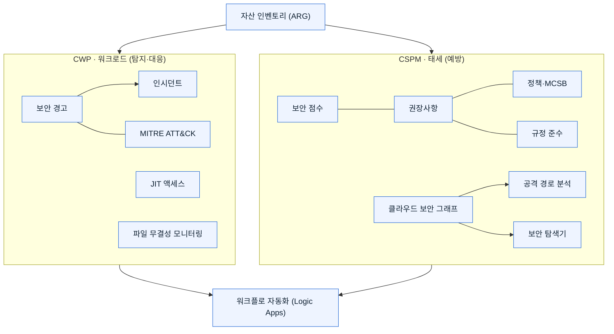

[🏠 전체 목차](./README.md)　·　**Part 1 · 시작하기**　·　페이지 3 / 8

# 02 · 핵심 개념 — Defender for Cloud 용어 사전

> [!NOTE]
> **이 페이지에서 얻는 것**
> - 보안 점수·권장사항·정책/표준(MCSB) 같은 태세 관리의 뼈대
> - 클라우드 보안 그래프·공격 경로·클라우드 보안 탐색기의 관계
> - 보안 경고·인시던트·MITRE ATT&CK 매핑
> - 규정 준수, 워크플로 자동화, 에이전트리스 vs 에이전트, CWP vs CSPM
>
> ⏱️ 예상 소요 **10분**　·　🎯 대상: 모든 독자(용어 정리)

이 페이지는 Defender for Cloud를 다룰 때 반복 등장하는 **핵심 용어**를 한 번에 정리합니다. 각 개념의 실제 사용법은 Part 2(CSPM·CWP·DevSecOps)와 Part 3(실습)에서 다룹니다.

---

## 1. 보안 점수 (Secure Score)

보안 상태를 **단일 백분율 지표**로 집계해, 한눈에 현재 태세를 파악하게 합니다. **점수가 높을수록 식별된 위험이 낮습니다.**

> [!IMPORTANT]
> **보안 점수 모델은 이제 두 가지입니다.**
> - **클래식 Secure Score** (Azure 포털) — MCSB 컨트롤 기반 계산
> - **Cloud Secure Score (위험 기반)** (Defender 포털) — 자산 위험 요소·중요도를 반영한 새 모델
>
> 두 모델은 **계산식과 값이 완전히 다르며, 숫자로 직접 비교할 수 없습니다.**

**계산 방식(클래식)**

- **컨트롤 점수** = `(최대 점수 / (정상 + 비정상 리소스)) × 정상 리소스`
- **구독 점수** = 모든 컨트롤의 현재 점수 합 / 최대 점수 합
- **다중 구독** = 리소스 수 기반 **가중 평균**(단순 평균 아님)

**핵심 규칙**

- **내장 MCSB 권장사항만** 점수에 반영(커스텀 표준 제외)
- **미리 보기(Preview) 권장사항은 점수에서 제외**
- 컨트롤은 구독/커넥터별로 **8시간마다** 재계산
- 2026년 6월 30일부터 **AWS/GCP 멀티클라우드 권장사항 200여 개**가 점수에 기여(GA)

주요 보안 컨트롤(최대 점수): MFA 사용(10) · 관리 포트 보호(8) · 시스템 업데이트 적용(6) · 취약성 수정(6) · 보안 구성 수정(4) · 액세스/권한 관리(4) · 저장 데이터 암호화(4) 등.

참고: [보안 점수](https://learn.microsoft.com/en-us/azure/defender-for-cloud/secure-score-security-controls)

## 2. 보안 권장사항 (Recommendations)

리소스를 보안 표준(MCSB + 할당된 규정 표준 + 커스텀)에 맞춰 지속 평가한 뒤, 기준을 충족하지 못한 리소스에 대해 생성되는 **실행 가능한 조치**입니다.

각 권장사항에는 문제 설명, **단계별 수정(remediation) 가이드**, 영향받는 리소스, 심각도·위험 요소, (가능 시) **공격 경로 컨텍스트**가 포함됩니다. 각 권장사항은 MCSB의 **보안 컨트롤**에 속하며, 한 컨트롤의 권장사항을 모두 수정해야 해당 컨트롤의 점수를 온전히 얻습니다.

- **표시 방식**: 평면 목록 / 제목별 그룹 / 리소스별 그룹
- **위험 우선순위화**: 인터넷 노출·데이터 민감도·측면 이동·악용 가능성 기반 (**Defender CSPM 필요**)
- **커스텀 권장사항**: **KQL**로 작성 (**Defender CSPM 필요**)
- **예외(Exemption)**: *Mitigated*(타 서비스가 완화 → 정상으로 계산) / *Risk Accepted*(점수 계산에서 제외). 적용에 최대 24시간, 구독당 5,000개 한도. 커스텀 권장사항에는 적용 불가

참고: [보안 정책 개념](https://learn.microsoft.com/en-us/azure/defender-for-cloud/security-policy-concept) · [권장사항 검토](https://learn.microsoft.com/en-us/azure/defender-for-cloud/review-security-recommendations) · [리소스 예외](https://learn.microsoft.com/en-us/azure/defender-for-cloud/exempt-resource)

## 3. 보안 정책 · 표준 · 이니셔티브

보안 정책은 클라우드 리소스 구성을 평가하는 **표준·컨트롤·평가 로직**을 정의하며, **Azure Policy 엔진**(AuditIfNotExists, DeployIfNotExists, Deny 효과)으로 구현됩니다.

**세 가지 보안 표준 유형**

| 유형 | 설명 |
| --- | --- |
| **보안 벤치마크** | 내장 기준선 — MCSB가 기본값. AWS·GCP는 각 클라우드 기본 벤치마크 자동 적용 |
| **규정 준수 표준** | NIST SP 800-53, PCI DSS, ISO 27001, CIS 등 (유료 플랜 1개 이상 필요) |
| **커스텀 표준** | 조직 정의 표준. 내장 또는 커스텀(KQL) 권장사항 포함 (**Defender CSPM 필요**) |

MDC를 켜면 **MCSB가 자동 할당**되어 평가를 시작합니다. 각 MCSB 권장사항은 **Azure Policy 정의로 매핑**되어, 결과가 MDC와 Azure Policy 양쪽에 표시됩니다.

참고: [보안 정책 개념](https://learn.microsoft.com/en-us/azure/defender-for-cloud/security-policy-concept)

## 4. Microsoft 클라우드 보안 벤치마크 (MCSB)

Azure 및 멀티클라우드(Azure·AWS·GCP)를 위한 Microsoft의 **규범적 보안 모범 사례 프레임워크**로, MDC 활성화 시 적용되는 **기본 보안 표준**입니다. CIS·NIST SP 800-53·PCI-DSS, Well-Architected/Cloud Adoption Framework, Zero Trust 원칙 등을 종합합니다.

**구조**: 보안 도메인 → 보안 컨트롤 → 하위 컨트롤 → 기준선(Baseline).

- **MCSB v1** — GA, 현재 MDC 기본 표준
- **MCSB v2** — **미리 보기** — 새 AI 보안 도메인, 확장된 Azure Policy 매핑, 위험/위협 기반 가이드 추가

**클라우드 중립성**: 동일한 보안 원칙을 Azure·AWS·GCP에 적용하되 클라우드별 구현 가이드를 제공 → **단일 규정 준수 대시보드**로 멀티클라우드를 한눈에.

참고: [MCSB 소개](https://learn.microsoft.com/en-us/security/benchmark/azure/introduction) · [규정 준수 개념](https://learn.microsoft.com/en-us/azure/defender-for-cloud/concept-regulatory-compliance)

## 5. 클라우드 보안 그래프 · 공격 경로 · 클라우드 보안 탐색기

> [!NOTE]
> 이 세 가지는 모두 **Defender CSPM(유료)** 이 필요하며, **VM 에이전트리스 스캔** 또는 **Defender for Servers의 취약성 평가**가 함께 필요합니다.

- **클라우드 보안 그래프(Cloud Security Graph)** — 멀티클라우드 데이터를 모델링하는 **그래프 기반 컨텍스트 엔진**. 자산 인벤토리, 네트워크 연결, 인터넷 노출, ID 권한 관계, 측면 이동 가능성, 취약성, 컨테이너 토폴로지를 노드로 담습니다. 사용자가 직접 쿼리하지 않고, 아래 두 기능을 뒷받침합니다.
- **공격 경로 분석(Attack Path Analysis)** — 그래프를 순회해 **외부 진입점에서 핵심 자산까지의 실제 악용 가능한 경로**를 자동 식별합니다. **능동 도달성 검증(active reachability)** 으로 실제 외부에서 도달 가능한지 확인해 오탐을 줄입니다. VM·스토리지·컨테이너·서버리스·API·AI 에이전트 등을 포괄합니다.
- **클라우드 보안 탐색기(Cloud Security Explorer)** — 그래프에 대해 **대화형 경로 탐색 쿼리**를 만들어 위험을 능동적으로 헌팅하는 쿼리 빌더입니다.

참고: [공격 경로 분석](https://learn.microsoft.com/en-us/azure/defender-for-cloud/concept-attack-path)

## 6. 보안 경고 (Alerts) · 인시던트 (Incidents)

**보안 경고**는 **유료 워크로드(Defender) 플랜**이 위협을 탐지할 때 생성되는 알림입니다. 각 경고에는 영향받는 리소스, 문제 설명, 수정 단계, 심각도가 포함되며, 포털에 **90일간** 표시(리소스 삭제 후에도)됩니다.

| 심각도 | 의미 |
| --- | --- |
| **High** | 침해 가능성 높음, 악의적 의도 확신 높음 (예: Mimikatz 탐지) |
| **Medium** | 의심 활동, 중간 확신 (예: ML 기반 비정상 위치 로그인) |
| **Low** | 무해하거나 차단된 공격일 수 있음, 확신 낮음 |
| **Informational** | 단독으로는 위협 아님, 인시던트 맥락에서 의미 |

**탐지 방식**: 행위 분석(ML) · 이상 탐지(배포별 기준선) · 통합 위협 인텔리전스 · Microsoft 보안 연구.

**보안 인시던트**는 하나의 공격 캠페인을 나타내는 **상관된 경고 묶음**입니다. MDC는 AI로 관련 신호를 그룹화해 단일 공격 뷰를 제공하고 **알림 피로를 줄입니다**. 경고·인시던트는 CSV, Event Hubs/Log Analytics, **Microsoft Sentinel(SIEM)** 등으로 내보낼 수 있습니다.

참고: [보안 경고 개요](https://learn.microsoft.com/en-us/azure/defender-for-cloud/alerts-overview)

## 7. MITRE ATT&CK 매핑

MDC는 **MITRE ATT&CK 엔터프라이즈 매트릭스**를 활용해 각 경고를 **전술적 의도**(Initial Access, Execution, Persistence, Privilege Escalation, Lateral Movement, Exfiltration, Impact 등)에 매핑합니다. 이를 통해 공격 단계별 필터·그룹화, 인시던트 상관, 저신뢰 신호의 의도 파악이 가능합니다. 전체 경고–ATT&CK 매핑은 [경고 참조 문서](https://learn.microsoft.com/en-us/azure/defender-for-cloud/alerts-reference)에 있습니다.

참고: [보안 경고 개요](https://learn.microsoft.com/en-us/azure/defender-for-cloud/alerts-overview)

## 8. 규정 준수 대시보드

클라우드 리소스 구성을 할당된 **규정·산업 표준의 컨트롤**에 매핑해 컨트롤별 통과/실패를 보여주는 대시보드입니다.

- MDC 활성화 시 **MCSB가 기본 할당**(무료). 그 외 표준은 **유료 플랜 1개 이상** 필요
- 지원 표준(비완전): NIST SP 800-53, PCI DSS, ISO/IEC 27001, CIS Azure Foundations, SOC 2, FedRAMP, HIPAA/HITRUST, AWS·GCP 제공업체 표준
- 각 컨트롤은 **자동 평가(Azure Policy 기반)** 와/또는 **수동 증명(manual attestation)** 으로 구성. 평가는 약 **12시간마다**
- **PDF 보고서**, 감사 보고서(PCI/SOC/ISO 인증서), 지속 내보내기 지원
- 할당된 표준은 **Microsoft Purview 규정 준수 관리자**에 자동 노출

참고: [규정 준수 대시보드](https://learn.microsoft.com/en-us/azure/defender-for-cloud/regulatory-compliance-dashboard) · [규정 준수 개념](https://learn.microsoft.com/en-us/azure/defender-for-cloud/concept-regulatory-compliance)

## 9. 워크플로 자동화 (Workflow Automation)

MDC 보안 이벤트에 반응해 **Azure Logic Apps(소비 계층)** 를 트리거하는 기능입니다.

**세 가지 트리거**: 권장사항 생성/변경 · 경고 생성/변경(심각도 필터 가능) · 규정 준수 평가 변경.

- 조건을 더 세밀히 필터링 가능(예: "SQL" 포함 경고, High 심각도만)
- 포털의 경고·권장사항 상세 페이지에서 **수동 실행**도 가능
- **관리 그룹 전체 배포**를 위한 3개의 내장 Azure Policy(DeployIfNotExists) 제공
- 필요 역할: 리소스 그룹의 **Security Admin/Owner** + **Logic App Contributor**(생성·수정) 또는 **Logic App Operator**(실행만)

참고: [워크플로 자동화](https://learn.microsoft.com/en-us/azure/defender-for-cloud/workflow-automation)

## 10. 에이전트리스 스캔 vs 에이전트 기반

> [!WARNING]
> **레거시 Log Analytics 에이전트(MMA)는 2024년 은퇴**했고, **적응형 애플리케이션 제어(Adaptive Application Controls)는 2024년 8월 지원 중단**되었습니다. 지금은 **MDE 에이전트 + 에이전트리스 스캔** 조합으로 전환되었습니다.

- **에이전트리스 스캔**(Defender CSPM / Servers P2) — VM 디스크 **스냅샷**을 대역 외로 분석 후 **수 분 내 삭제**. 에이전트·네트워크·성능 영향 없음. 취약성·시크릿·소프트웨어 인벤토리·EDR 설정 평가, **악성코드 스캔(Servers P2 전용)** 포함. 대상: Azure VM, AWS EC2, GCP 인스턴스.
- **MDE 에이전트** — OS 수준 실시간 위협 탐지, **FIM**(Log Analytics로 준실시간 스트리밍), 취약성 평가(에이전트리스와 하이브리드), 차세대 백신.
- **AMA** — Defender for SQL servers on machines, 그리고 일 500MB 무료 수집 혜택.

참고: [에이전트리스 스캔](https://learn.microsoft.com/en-us/azure/defender-for-cloud/concept-agentless-data-collection) · [Servers 에이전트 계획](https://learn.microsoft.com/en-us/azure/defender-for-cloud/plan-defender-for-servers-agents)

## 11. CWP vs CSPM — 개념적 구분

| 구분 | **CSPM** (태세 관리) | **CWP / CWPP** (워크로드 보호) |
| --- | --- | --- |
| 답하는 질문 | "내 리소스가 올바르게 구성됐는가?" | "지금 누가 공격하고 있는가?" |
| 산출물 | 권장사항, 규정 준수 점수, 태세 지표 | 보안 경고, 인시던트 상관 |
| 시점 | 지속 평가(구성 상태) | 실시간/준실시간 위협 탐지 |
| 주요 플랜 | 기본 CSPM(무료) 또는 Defender CSPM(유료) | 워크로드별 Defender 플랜 |
| 조치 계기 | 구성 오류/정책 위반 | 비정상·악의적 행위 |

두 가지 모두 **DevSecOps**와 함께 **CNAPP**를 구성합니다(→ [00 · 개요](./00-overview.md)).

참고: [Defender for Cloud 소개](https://learn.microsoft.com/en-us/azure/defender-for-cloud/defender-for-cloud-introduction)

## 12. 대표적 CWP 기능 — JIT · FIM

- **Just-in-Time(JIT) VM 액세스** (Servers P2) — 관리 포트(RDP 3389, SSH 22)를 평소 **차단**해 두고, 요청 시 Azure RBAC로 검증한 뒤 **요청자 IP에 한해 지정 시간만 개방**합니다. 시간 만료 시 다시 차단(활성 연결은 유지). AWS에서는 EC2 보안 그룹을 수정합니다.
- **파일 무결성 모니터링(FIM)** (Servers P2) — OS 파일, 레지스트리 키, 애플리케이션 파일의 변경을 모니터링해 공격 징후를 탐지합니다. 지금은 **MDE 기반**(준실시간) + 에이전트리스(24시간 주기). **PCI-DSS·ISO 17799** 등이 요구합니다. 구독당 최대 500개 커스텀 규칙.
- **적응형 애플리케이션 제어(Adaptive Application Controls)** — ⚠️ **2024년 8월 지원 중단.** 현재 사용 불가로 문서화해야 합니다.

참고: [JIT VM 액세스](https://learn.microsoft.com/en-us/azure/defender-for-cloud/just-in-time-access-overview) · [파일 무결성 모니터링](https://learn.microsoft.com/en-us/azure/defender-for-cloud/file-integrity-monitoring-overview)

## 13. 자산 인벤토리 (Asset Inventory)

MDC에 연결된 **모든 클라우드 리소스(Azure·AWS·GCP)의 통합 멀티클라우드 뷰**로, **Azure Resource Graph(ARG)** 로 구동되어 KQL로 대규모 쿼리가 가능합니다.

- 연결된 리소스, 전체 보안 상태(총계·비정상·환경별), 리소스별 권장사항·경고
- **위험 우선순위화**(노출·데이터 민감도·측면 이동·공격 경로 기반, **Defender CSPM 필요**)
- **소프트웨어 인벤토리**, 자산별 커버리지 상태(**Protected / Partial / Unprotected / Excluded**)
- Defender 포털에서는 워크로드 탭(All Assets, VMs, Data, Containers, AI, API, DevOps, Identity, Serverless)과 **자산 중요도 분류**를 제공

참고: [자산 인벤토리](https://learn.microsoft.com/en-us/azure/defender-for-cloud/asset-inventory)

---

## 개념 지도 (한눈에)

---

## 참고 링크

- [보안 점수](https://learn.microsoft.com/en-us/azure/defender-for-cloud/secure-score-security-controls)
- [보안 정책 개념](https://learn.microsoft.com/en-us/azure/defender-for-cloud/security-policy-concept)
- [MCSB 소개](https://learn.microsoft.com/en-us/security/benchmark/azure/introduction)
- [공격 경로 분석 / 클라우드 보안 그래프](https://learn.microsoft.com/en-us/azure/defender-for-cloud/concept-attack-path)
- [보안 경고 개요](https://learn.microsoft.com/en-us/azure/defender-for-cloud/alerts-overview)
- [규정 준수 대시보드](https://learn.microsoft.com/en-us/azure/defender-for-cloud/regulatory-compliance-dashboard)
- [워크플로 자동화](https://learn.microsoft.com/en-us/azure/defender-for-cloud/workflow-automation)
- [에이전트리스 스캔](https://learn.microsoft.com/en-us/azure/defender-for-cloud/concept-agentless-data-collection)
- [자산 인벤토리](https://learn.microsoft.com/en-us/azure/defender-for-cloud/asset-inventory)

---

### 다음 읽을거리

| ◀ 이전 | ▶ 다음 |
| :-- | --: |
| [01 · 사전 준비](./01-prerequisites.md) | [03 · CSPM](./03-cspm.md) |

[🏠 전체 목차로 돌아가기](./README.md)
