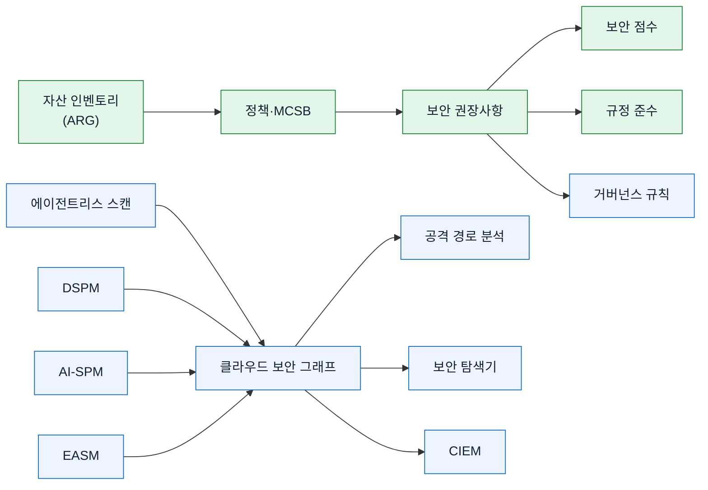

[🏠 전체 목차](./README.md)　·　**Part 2 · 핵심 기능**　·　페이지 4 / 8

# 03 · CSPM — 클라우드 보안 태세 관리

> [!NOTE]
> **이 페이지에서 얻는 것**
> - 무료 기본 CSPM과 유료 Defender CSPM의 **완전한 기능 경계**
> - 보안 점수·권장사항·정책이 실제로 어떻게 동작하는지
> - 클라우드 보안 그래프·공격 경로·보안 탐색기·DSPM·CIEM·AI-SPM 심화
> - 거버넌스와 규정 준수로 운영을 마무리하는 법
>
> ⏱️ 예상 소요 **15분**　·　🎯 대상: 클라우드 보안 엔지니어, 보안 관리자, CISO

CSPM은 **"내 리소스가 올바르게 구성됐는가?"** 에 답하는 축입니다. Defender for Cloud는 이를 **무료 기본 CSPM**과 **유료 Defender CSPM** 두 계층으로 제공합니다. 이 페이지는 두 계층의 기능을 세부까지 다룹니다.

> [!IMPORTANT]
> 이 페이지의 상당수 고급 기능(공격 경로, 보안 탐색기, DSPM, CIEM, AI-SPM, 거버넌스, 규정 준수 표준, 위험 우선순위화)은 **Defender CSPM(유료)** 이 필요합니다. 무료로 쓸 수 있는 범위는 §1 표에서 명확히 구분합니다.

---

## 1. 무료 기본 CSPM vs 유료 Defender CSPM

| 기능 | 기본 CSPM (무료) | Defender CSPM (유료) |
| --- | :---: | :---: |
| 자산 인벤토리 | ✅ | ✅ |
| 데이터 내보내기(SIEM 등) · Workbooks | ✅ | ✅ |
| MCSB · 보안 점수 · 보안 권장사항 | ✅ | ✅ |
| 수동 수정 · 워크플로 자동화 | ✅ | ✅ |
| **공격 경로 분석** | ❌ | ✅ |
| **클라우드 보안 탐색기** | ❌ | ✅ |
| **위험 우선순위화** | ❌ | ✅ |
| 에이전트리스 VM 취약성 / 시크릿 스캔 | ❌ | ✅ |
| 에이전트리스 컨테이너 취약성 평가 · K8s 탐색 | ❌ | ✅ |
| **데이터 보안 태세 관리(DSPM)** | ❌ | ✅ |
| **AI 보안 태세 관리(AI-SPM)** · API 보안 태세 | ❌ | ✅ |
| **중요 자산 보호 · 인터넷 노출 분석** | ❌ | ✅ |
| **커스텀 권장사항(KQL)** | ❌ | ✅ |
| **규정 준수 표준 평가** | ❌ | ✅ |
| **거버넌스 규칙** | ❌ | ✅ |
| **EASM(외부 공격 표면) 통합** · CIEM | ❌ | ✅ |
| 코드 투 클라우드 매핑 · PR 주석 | ❌ | ✅ |
| ServiceNow 통합(Preview) | ❌ | ✅ |

**Defender CSPM 과금 대상**(예): Azure VM·스토리지 계정·SQL/PostgreSQL/MySQL·Synapse, AWS EC2·S3·RDS, GCP Compute·Storage 버킷·Cloud SQL. (할당 해제 VM, Blob/파일 없는 스토리지 계정 등은 제외)

참고: [CSPM 개요](https://learn.microsoft.com/en-us/azure/defender-for-cloud/concept-cloud-security-posture-management)

## 2. 보안 점수 (Secure Score)

보안 상태를 단일 백분율로 집계합니다. **두 모델**이 있으니 혼동에 주의하세요.

| 모델 | 포털 | 특징 |
| --- | --- | --- |
| **클래식 Secure Score** | Azure 포털 | MCSB 컨트롤 기반 계산 |
| **Cloud Secure Score(위험 기반)** | Defender 포털 | 자산 위험 요소·중요도 반영, 더 정확한 우선순위 |

**계산식(클래식)**
- 컨트롤 점수 = `(최대 점수 / 총 리소스) × 정상 리소스` — 예: 최대 6, 정상 4 / 총 78 → `6/78 × 4 = 0.31`
- 구독 점수 = 컨트롤 현재 점수 합 / 최대 점수 합
- 다중 구독 = 리소스 수 기반 **가중 합산**(단순 평균 아님)

**규칙**: Preview 권장사항 제외 · 8시간마다 재계산 · **내장 MCSB만** 반영. 2026년 6월 30일부터 AWS/GCP 권장사항 200여 개가 점수에 기여(GA).

**주요 컨트롤(최대 점수)**: MFA(10) · 관리 포트 보안(8) · 시스템 업데이트(6) · 취약성 수정(6) · 보안 구성(4) · 액세스/권한(4) · 저장/전송 암호화(각 4) · 네트워크 접근 제한(4) …

참고: [보안 점수](https://learn.microsoft.com/en-us/azure/defender-for-cloud/secure-score-security-controls)

## 3. 보안 권장사항 라이프사이클

**표시 방식**: 평면 목록 / 제목별 그룹 / 리소스별 그룹.
**카테고리 탭**: 전체 / 잘못된 구성(Misconfigurations) / 취약성(Vulnerabilities) / 노출된 시크릿(Exposed Secrets).

### 수정(Remediation) 옵션

| 옵션 | 기능 |
| --- | --- |
| **Fix** 🔧 | 여러 리소스에 자동 수정 로직 적용 |
| **Enforce** 🔒 | 비준수 리소스 생성 시 정책 자동 배포(점수 하락 방지) |
| **Deny** 🚫 | 문제를 가진 새 리소스 **생성 차단** |

### 위험 우선순위화 (Defender CSPM)
위험 수준(**Critical/High/Medium/Low/Not evaluated**)을 데이터 민감도·인터넷 노출·측면 이동·악용 가능성으로 산정합니다. Defender CSPM이 없으면 위험 열이 흐리게 표시됩니다. 권장사항의 **Graph 탭**에서 공격 경로 맥락을 볼 수 있습니다.

### 예외(Exemption)

| 유형 | 효과 |
| --- | --- |
| **Mitigated**(타 서비스로 완화) | 정상으로 계산 → 점수 상승 |
| **Risk accepted**(위험 수용) | 점수 계산에서 제외 |

적용까지 최대 24시간, 구독당 5,000개 한도, KQL 커스텀 권장사항엔 적용 불가. 예외 리소스는 **Not applicable** 탭에 표시.

참고: [권장사항 검토](https://learn.microsoft.com/en-us/azure/defender-for-cloud/review-security-recommendations) · [리소스 예외](https://learn.microsoft.com/en-us/azure/defender-for-cloud/exempt-resource)

## 4. 보안 정책 · 표준 · MCSB

| 표준 유형 | 설명 |
| --- | --- |
| **보안 벤치마크** | MCSB(기본), 클라우드 공급자 벤치마크(AWS Foundational Security Best Practices, GCP Default) 자동 적용 |
| **규정 준수 표준** | NIST·PCI DSS·ISO 27001·CIS 등 (유료 플랜 필요) |
| **커스텀 표준** | KQL 기반 커스텀 권장사항 결합 (Defender CSPM 필요) |

**MCSB**는 Azure 구독 활성화 시 자동 할당되며, 클래식 보안 점수에 반영되는 것은 MCSB 권장사항뿐입니다. 정책 기반 권장사항은 **Azure Policy 정의**로 뒷받침되고, KQL 기반 커스텀 권장사항은 표준 assessment key 형식을 씁니다.

참고: [보안 정책 개념](https://learn.microsoft.com/en-us/azure/defender-for-cloud/security-policy-concept)

## 5. 클라우드 보안 그래프 · 공격 경로 · 보안 탐색기

> [!NOTE]
> 세 기능 모두 **Defender CSPM + 에이전트리스 스캔**이 필요합니다.

### 클라우드 보안 그래프
멀티클라우드 데이터를 노드로 모델링하는 컨텍스트 엔진 — 자산 인벤토리, 자산 간 연결, 측면 이동 가능성, 인터넷 노출, IAM 권한, 취약성, 컨테이너/서버리스/API/AI 에이전트. 정기(일별) 스냅샷으로 갱신됩니다.

### 공격 경로 분석
1. 외부 진입점(인터넷 노출 취약 리소스) 식별
2. 독자 알고리즘으로 다음 단계 탐색 → 핵심 자산(민감 데이터 DB 등)까지 추적
3. **능동적 도달성 스캔**으로 실제 외부 접근 가능성 검증 → 오탐 감소

- **Azure 포털**: Defender for Cloud → Attack path analysis
- **Defender 포털**: Exposure Management → Attack surface → Attack paths (Overview 탭에서 **초크포인트**·Top 시나리오 제공)
- 경로 해소 후 목록에서 사라지기까지 최대 24시간

### 클라우드 보안 탐색기
그래프에 대한 **쿼리 기반 위험 헌팅** 도구 — 드롭다운 쿼리 빌더, 시작 템플릿, 쿼리 URL 공유, CSV 내보내기. Azure·AWS·GCP 전체의 노출·권한·측면 이동을 쿼리합니다.

참고: [공격 경로 분석](https://learn.microsoft.com/en-us/azure/defender-for-cloud/concept-attack-path) · [공격 경로 관리](https://learn.microsoft.com/en-us/azure/defender-for-cloud/how-to-manage-attack-path) · [보안 탐색기](https://learn.microsoft.com/en-us/azure/defender-for-cloud/how-to-manage-cloud-security-explorer)

## 6. 데이터 보안 태세 관리 (DSPM)

민감 데이터가 어디에 있고 얼마나 노출됐는지 파악합니다(Defender CSPM 또는 민감 데이터 탐색 확장이 있는 Defender for Storage).

- **자동 탐색**: Azure(Blob·SQL·Cosmos DB·Data Lake 등), AWS(S3·RDS), GCP(Cloud Storage만)
- **스마트 샘플링**: 스토리지는 파일당 최대 20MB, DB는 300~1,024행 비차단 쿼리
- **분류**: Microsoft Purview의 SIT·민감도 레이블 상속(커스텀 SIT 가져오기, 민감 임계값 설정)
- **데이터 인식 공격 경로**: "인터넷 노출 → 민감 데이터 저장소 접근" 경로 시각화

참고: [데이터 보안 태세](https://learn.microsoft.com/en-us/azure/defender-for-cloud/concept-data-security-posture)

## 7. 에이전트리스 스캔

VM 디스크 스냅샷을 대역 외로 분석 후 **수 분 내 삭제**합니다(에이전트·네트워크·성능 영향 없음). 스냅샷은 VM과 동일 리전에 유지됩니다.

| 스캔 | 필요 플랜 |
| --- | --- |
| EDR 설정 · 소프트웨어 인벤토리 · 취약성 평가 | Defender CSPM 또는 Servers P2 |
| **시크릿 스캔**(평문 시크릿) | Defender CSPM |
| **악성코드 스캔** | Defender for Servers P2 전용 |
| Kubernetes 노드 VM 스캔 | Servers P2 또는 Containers |

대상: Azure VM, AWS EC2, GCP Compute. 스캐너용 읽기 전용 역할이 자동 부여되며, CMK/CMEK 암호화 디스크는 키 권한이 추가됩니다.

참고: [에이전트리스 스캔](https://learn.microsoft.com/en-us/azure/defender-for-cloud/concept-agentless-data-collection)

## 8. CIEM — 클라우드 인프라 권한 관리

멀티클라우드 ID·액세스 위험을 탐색·평가하고 **최소 권한**을 시행합니다(Defender CSPM 내장).

- **지원 ID**: Entra ID(사용자·그룹·서비스 주체), AWS IAM, GCP IAM
- **유효 권한 분석**: 누가 민감 데이터·인터넷 노출 리소스에 도달 가능한지 식별
- **ID 위험 권장사항**: 비활성/게스트 계정 권한 제거, 관리 권한 제한, 과다 권한 적정화, AWS IAM MFA 적용
- 클라우드 보안 탐색기·공격 경로·CIEM 워크북으로 조회

참고: [권한 관리(CIEM)](https://learn.microsoft.com/en-us/azure/defender-for-cloud/permissions-management)

## 9. 거버넌스 규칙

권장사항에 **소유자·마감일**을 자동 할당해 책임과 SLA를 만듭니다(Defender CSPM).

- **소유자 지정**: 리소스 태그 키 기반 또는 이메일 직접 지정
- **마감일**: 7/14/30/90일 · **유예 기간**: 활성화 시 마감 전까지 점수에 영향 없음
- **알림**: 소유자에게 **주간 이메일**, 지연 항목은 소유자의 매니저에게도 발송
- **우선순위**(1~1000)로 규칙 충돌 해결, 관리 그룹 범위가 구독 범위보다 우선
- **거버넌스 보고서**로 규칙별·소유자별 완료 현황 조회

참고: [거버넌스 규칙](https://learn.microsoft.com/en-us/azure/defender-for-cloud/governance-rules)

## 10. 규정 준수 대시보드

리소스 구성을 표준 컨트롤에 매핑해 pass/fail을 보여 줍니다(추가 표준은 유료 플랜 필요, MCSB는 기본·무료). 평가는 약 **12시간마다**.

- **자동 평가 + 수동 증명**, **PDF/감사 보고서**(PCI·SOC·ISO 인증서), **지속 내보내기**, **Purview Compliance Manager 연동**
- 주요 표준: MCSB, NIST CSF 2.0 / 800-53 / 800-171, PCI DSS v4, ISO 27001/27002/27017, CIS(Azure/AWS/GCP), SOC, GDPR, NIS2, DORA, EU AI Act, HITRUST, **k-ISMS-P(한국)** 등

> [!TIP]
> 한국 고객 데모·컨설팅에서는 **k-ISMS-P**, **ISO/IEC 27001:2022**, **PCI DSS**를 표준으로 추가해 보여 주면 전달력이 높습니다.

참고: [규정 준수 대시보드](https://learn.microsoft.com/en-us/azure/defender-for-cloud/regulatory-compliance-dashboard) · [규정 준수 표준](https://learn.microsoft.com/en-us/azure/defender-for-cloud/concept-regulatory-compliance-standards)

## 11. AI 보안 태세 관리 (AI-SPM)

생성형 AI 워크로드까지 CNAPP 범위를 확장합니다(Defender CSPM).

- **탐색**: Azure(Azure OpenAI·AI Foundry·ML), AWS(Amazon Bedrock), GCP(Vertex AI)
- **AI BOM**: 애플리케이션·데이터(훈련/파인튜닝)·모델 아티팩트·코드 투 클라우드 전 범위
- **취약성**: TensorFlow·PyTorch·LangChain 등 라이브러리 의존성, IaC 구성 오류, 컨테이너 이미지
- **인터넷 노출 AI 엔드포인트** 하이라이트 + 인증·관리 ID 권장사항, **AI 공격 경로** 분석

> [!NOTE]
> AI **에이전트** 수준 탐색·태세는 2026년 7월 1일부터 **Microsoft Agent 365** 라이선스가 필요합니다(Defender CSPM은 Foundry 계정/프로젝트 탐색은 지속 지원).

참고: [AI 보안 태세](https://learn.microsoft.com/en-us/azure/defender-for-cloud/ai-security-posture)

## 12. EASM 통합 · 자산 인벤토리

- **EASM(외부 공격 표면 관리)** — Defender CSPM에 기본 포함. Microsoft EASM으로 **외부에서 안으로(outside-in)** 스캔해, Defender CSPM의 내부 시각(inside-out)과 결합합니다.
- **자산 인벤토리** — **Azure Resource Graph(ARG)** 기반 통합 멀티클라우드 뷰. KQL 쿼리, 리소스별 권장사항·경고, 위험 우선순위화, 커버리지 상태(Protected/Partial/Unprotected/Excluded).

참고: [EASM 통합](https://learn.microsoft.com/en-us/azure/defender-for-cloud/concept-easm) · [자산 인벤토리](https://learn.microsoft.com/en-us/azure/defender-for-cloud/asset-inventory)

---

## 한눈에 — CSPM 기능 지도

> 🟩 초록 = 무료 기본 CSPM · 🟦 파랑 = Defender CSPM(유료)

---

## 참고 링크

- [CSPM 개요](https://learn.microsoft.com/en-us/azure/defender-for-cloud/concept-cloud-security-posture-management)
- [보안 점수](https://learn.microsoft.com/en-us/azure/defender-for-cloud/secure-score-security-controls)
- [공격 경로 분석](https://learn.microsoft.com/en-us/azure/defender-for-cloud/concept-attack-path)
- [데이터 보안 태세(DSPM)](https://learn.microsoft.com/en-us/azure/defender-for-cloud/concept-data-security-posture)
- [권한 관리(CIEM)](https://learn.microsoft.com/en-us/azure/defender-for-cloud/permissions-management)
- [거버넌스 규칙](https://learn.microsoft.com/en-us/azure/defender-for-cloud/governance-rules)
- [규정 준수 대시보드](https://learn.microsoft.com/en-us/azure/defender-for-cloud/regulatory-compliance-dashboard)
- [AI 보안 태세](https://learn.microsoft.com/en-us/azure/defender-for-cloud/ai-security-posture)

---

### 다음 읽을거리

| ◀ 이전 | ▶ 다음 |
| :-- | --: |
| [02 · 핵심 개념](./02-concepts.md) | [04 · CWP](./04-cwp.md) |

[🏠 전체 목차로 돌아가기](./README.md)
