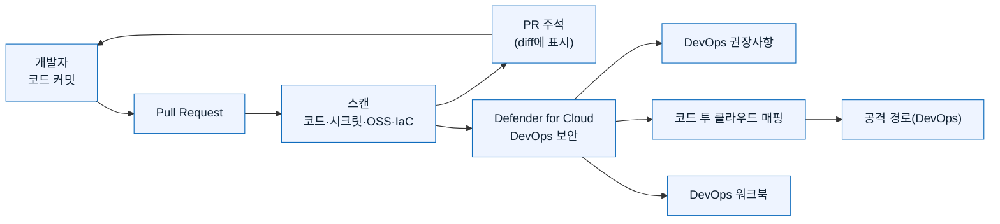

[🏠 전체 목차](./README.md)　·　**Part 2 · 핵심 기능**　·　페이지 6 / 8

# 05 · DevSecOps — 코드에서 클라우드까지 보안 통합

> [!NOTE]
> **이 페이지에서 얻는 것**
> - Azure DevOps·GitHub·GitLab 커넥터 온보딩과 필요 권한
> - 코드·시크릿·OSS·IaC 스캔이 어떤 도구로 수행되는지
> - PR 주석·코드 투 클라우드 매핑으로 shift-left 하는 법
> - DevOps 권장사항·워크북·자동화
>
> ⏱️ 예상 소요 **13분**　·　🎯 대상: DevSecOps·플랫폼 엔지니어, 애플리케이션 보안 담당

DevSecOps는 **"배포 전 코드·인프라에 위험이 있는가?"** 에 답하는 축입니다. 멀티 파이프라인·멀티클라우드 전반의 **코드 투 클라우드** 보안 태세를 하나의 콘솔로 관리합니다.

> [!NOTE]
> **이름 변경**: 이 기능은 원래 **"Defender for DevOps"** 였다가 **"DevOps security(Defender for Cloud의 DevOps 보안)"** 로 개명되었습니다. 일부 URL(`defender-for-devops-introduction`)과 문서에 옛 이름이 남아 있습니다.

---

## 1. 세 가지 핵심 역량과 플랜 계층

| # | 역량 | 설명 |
| --- | --- | --- |
| 1 | **DevOps 보안 태세 통합 가시성** | 멀티 파이프라인·멀티클라우드의 DevOps 인벤토리와 프로덕션 이전 코드 보안(코드·시크릿·OSS 스캔) 가시성 |
| 2 | **개발 수명 주기 전반의 클라우드 구성 강화** | IaC 템플릿·컨테이너 이미지를 사전 보안해 프로덕션 도달 구성 오류 최소화 |
| 3 | **코드 내 중대 이슈 우선순위 수정** | 코드 투 클라우드 컨텍스트로 우선순위화, **PR 주석**으로 개발자에게 소유권 할당 |

**플랜 계층**

| 기능 | 기초 CSPM (무료) | Defender CSPM (유료) |
| --- | :---: | :---: |
| DevOps 환경 연결·인벤토리 | ✅ | ✅ |
| 보안 권장사항(코드·IaC·시크릿·OSS) | ✅ | ✅ |
| DevOps 환경 태세 권장사항 | ✅ | ✅ |
| **PR 주석** | ❌ | ✅ |
| **코드 투 클라우드 컨테이너/IaC 매핑** | ❌ | ✅ |
| **공격 경로 분석 · 보안 탐색기(DevOps)** | ❌ | ✅ |

참고: [DevOps 보안 소개](https://learn.microsoft.com/en-us/azure/defender-for-cloud/defender-for-devops-introduction) · [DevOps 지원 매트릭스](https://learn.microsoft.com/en-us/azure/defender-for-cloud/devops-support)

## 2. 지원 플랫폼 · 커넥터 온보딩

세 플랫폼 모두 **GA**, **상용 Azure 클라우드 전용**(정부/21Vianet 미지원).

| 플랫폼 | 필요 권한(요약) | 특이사항 |
| --- | --- | --- |
| **Azure DevOps** | Azure 구독 **Contributor** + ADO **Project Collection Administrator** + Basic 액세스 레벨 | `TfsGit` 리포만 지원(TFVC 미지원). OAuth 3rd-party 액세스 On. 온보딩 후 최대 8시간. **Container Mapping 확장** 자동 설치 |
| **GitHub** | Azure **Contributor** + GitHub **Organization Owner** | GitHub App 설치. **테넌트당 GitHub 조직 1개** |
| **GitLab** | Azure **Contributor** + GitLab **Group Owner** | **GitLab Ultimate** 라이선스 필요. **PR(머지 리퀘스트) 주석 미지원** |

> [!TIP]
> 커넥터는 **인가한 계정의 ID로 동작**합니다(감사 로그에 그 계정으로 기록). 전용 서비스 계정(예: `MDC-DevOps-Connector`) 사용을 권장합니다.

지원 리전: East Asia, Australia East, Canada Central, West/North Europe, Sweden Central, UK South, East/Central US.

참고: [ADO 온보딩](https://learn.microsoft.com/en-us/azure/defender-for-cloud/quickstart-onboard-devops) · [GitHub 온보딩](https://learn.microsoft.com/en-us/azure/defender-for-cloud/quickstart-onboard-github) · [GitLab 온보딩](https://learn.microsoft.com/en-us/azure/defender-for-cloud/quickstart-onboard-gitlab)

## 3. DevOps 보안 페이지 · 태세 관리

**DevOps 보안** 콘솔은 세 섹션을 보여 줍니다 — **스캔 결과 지표**(심각도·유형별), **DevOps 환경 태세 권장사항**, **고급 보안 커버리지**(ADO·GitHub·GitLab별 활성 리소스 비율).

**인벤토리 테이블**: 이름 · DevOps 환경 · 고급 보안 상태(On/Off/부분/N/A) · **PR 주석 상태**(현재 ADO만) · 발견 수. 리포지토리 평면 뷰 또는 조직→프로젝트→그룹 계층 뷰.

**태세 관리 스캐너**는 연결 시 자동 구성되어 **24시간마다** 빌드·보안 파일·변수 그룹·서비스 연결·조직·리포지토리를 스캔합니다. 주요 컨트롤: 시크릿 접근 범위 최소화, 셀프 호스트 러너·고권한 제한, 브랜치 보호 강화, 최소 권한·리포 보안.

참고: [DevOps 태세 관리](https://learn.microsoft.com/en-us/azure/defender-for-cloud/concept-devops-posture-management-overview)

## 4. 스캔 유형과 도구

두 가지 전달 방식이 있습니다 — **① 파이프라인 내 스캔**(MSDO 확장/액션)과 **② 에이전트리스 코드 스캔**(Preview, 커넥터 기반).

| 스캔 | 내용 | 도구 |
| --- | --- | --- |
| **코드 스캔(SAST)** | Python·JS/TS 등 코딩 오류·취약점 | Bandit, ESLint, CodeQL(GHAS/GHAzDO) |
| **시크릿 스캔** | 노출된 자격 증명 | GitHub: GHAS / ADO: **GHAzDO**(CredScan은 2023-09-20 지원 중단) |
| **OSS 의존성 스캔** | 오픈소스·OS 패키지 취약점 | GitHub: Dependabot/GHAS · ADO: GHAzDO · 에이전트리스: **Trivy** + **Syft**(SBOM) |
| **IaC 구성 오류 스캔** | ARM·Bicep·Terraform·K8s 등 | **Template Analyzer**, **Checkov**, **Terrascan** |

**에이전트리스 코드 스캔(Preview)** — 파이프라인 수정 없이 REST API로 스캔. 코드/IaC는 일 1회, 태세는 8시간마다. 스캔당 SBOM 자동 생성(Syft). **ADO·GitHub만**(GitLab 미지원).

참고: [에이전트리스 코드 스캔](https://learn.microsoft.com/en-us/azure/defender-for-cloud/agentless-code-scanning) · [IaC 취약점](https://learn.microsoft.com/en-us/azure/defender-for-cloud/iac-vulnerabilities)

## 5. Microsoft Security DevOps (MSDO) 확장

파이프라인에 보안 도구를 통합하는 확장입니다.

- **Azure DevOps**: 마켓플레이스에서 설치(Project Collection Admin), 태스크 `MicrosoftSecurityDevOps@1`, 결과 아티팩트 `CodeAnalysisLogs`(SARIF). 서드파티 SARIF도 이 아티팩트로 게시하면 Defender for Cloud가 수집.
- **GitHub Actions**: `microsoft/security-devops-action@latest`(Windows·Linux). 권한 `security-events: write` 등, SARIF를 `codeql-action/upload-sarif`로 올리면 GHAS 코드 스캔 탭에 표시.

**번들 도구**: AntiMalware, Bandit, BinSkim, Checkov, ESLint, IaCFileScanner, Template Analyzer, Terrascan, Trivy. `categories: 'IaC'`로 IaC 전용 스캔 구성 가능.

```yaml
- task: MicrosoftSecurityDevOps@1
  displayName: 'Microsoft Security DevOps'
  # inputs:
  #   categories: 'code,artifacts,IaC,containers'
  #   tools: 'bandit,binskim,checkov,eslint,templateanalyzer,terrascan,trivy'
  #   break: false        # true면 High 심각도에 빌드 실패
  #   publish: true
  #   artifactName: 'CodeAnalysisLogs'
```

참고: [ADO 확장](https://learn.microsoft.com/en-us/azure/defender-for-cloud/azure-devops-extension) · [GitHub Action](https://learn.microsoft.com/en-us/azure/defender-for-cloud/github-action)

## 6. 풀 리퀘스트(PR) 주석

> [!IMPORTANT]
> PR 주석은 **Defender CSPM(유료)** 이 필요하며, **Azure DevOps·GitHub만** 지원(GitLab 미지원, GitHub은 GHAS 라이선스 필요).

- 주석은 PR이 도입한 **diff에만** 표시(파일 전체 취약점이 아님) → 개발자는 SCM에서, 보안팀은 Defender for Cloud에서 미해결 항목 확인
- 현재 지원 유형: **IaC 구성 오류**(ARM·Bicep·Terraform·CloudFormation·Dockerfile·Helm 등), 카테고리·최소 심각도 구성 가능
- **ADO 설정**: 메인 브랜치 **Build Validation 정책** On → DevOps 보안에서 리포 선택 → **Manage resources**에서 PR 주석 On
- **GitHub 설정**: MSDO 워크플로 YAML에 `pull_request: branches: ["main"]` 추가(+ GHAS)

> [!TIP]
> 핵심 가치는 **shift-left** — 문제를 프로덕션이 아니라 **PR 단계**에서, 별도 도구가 아니라 **개발자가 보는 화면**에서 잡습니다.

참고: [PR 주석 사용](https://learn.microsoft.com/en-us/azure/defender-for-cloud/enable-pull-request-annotations)

## 7. 코드 투 클라우드 컨텍스트화

배포 전 코드와 실행 중 클라우드 리소스를 연결합니다(대부분 Defender CSPM 필요).

- **컨테이너 이미지 매핑** — 커넥터 자동 매핑 / Docker 라벨 / GitHub attestation(SLSA). 보안 탐색기 → Container Images → *Pushed by code repositories*(최대 4시간). CI/CD로 빌드된 이미지만 지원.
- **IaC 템플릿 매핑** — GUID 태그(`yor_trace`)로 템플릿↔배포 리소스 상관. 오픈소스 **Yor** 자동 태깅. ARM·Bicep·CloudFormation·Terraform, ADO만.
- **코드 투 런타임 매핑** — 소스→CI/CD→레지스트리→런타임 가시성(현재 컨테이너 취약성 권장사항). 소유권 할당·GitHub 이슈 생성·타깃 예외.
- **공격 경로(DevOps 컨텍스트)** — 리포의 노출 시크릿이 클라우드 침해로 이어지는 경로 등. Defender CSPM + 에이전트리스 스캔 필요.

참고: [컨테이너 이미지 매핑](https://learn.microsoft.com/en-us/azure/defender-for-cloud/container-image-mapping) · [IaC 템플릿 매핑](https://learn.microsoft.com/en-us/azure/defender-for-cloud/iac-template-mapping)

## 8. DevOps 보안 권장사항

> [!NOTE]
> DevOps 권장사항은 **보안 점수에 영향을 주지 않습니다.**

두 그룹으로 나타납니다.

- **취약점 수정** — 코드 스캔·시크릿·OSS(CVSS)·IaC 발견 해소. 예: *ADO/GitHub 리포는 시크릿 스캔 발견을 해소해야 함*(High), *코드 스캔 발견 해소*(Medium), *IaC 스캔 발견 해소*(Medium)
- **향상된 보안 기능 사용** — GitHub 코드/시크릿/**Dependabot** 스캔 활성화, 브랜치 보호, 시크릿 푸시 보호, 최소 권한 등. ADO 측 GHAzDO 활성화, 서비스 연결·변수 그룹·보안 파일의 과다 접근 제한 등

플랫폼별로 GitHub·Azure DevOps·GitLab 권장사항 세트가 있으며, 다수는 브랜치 보호·2인 리뷰·셀프 승인 방지 등 **태세 항목**입니다(일부 Preview).

참고: [DevOps 권장사항 참조](https://learn.microsoft.com/en-us/azure/defender-for-cloud/recommendations-reference-devops)

## 9. GHAS · GHAzDO 통합

- **GHAS(GitHub Advanced Security)** — Defender CSPM + GHAS 라이선스 + GitHub 커넥터로 소스 코드를 실행 워크로드와 연결. GHAS 발견에 **런타임 위험 요소**(공격 경로 기반)를 주석해 프로덕션에 도달하는 취약점을 우선순위화.
- **GHAzDO(Azure DevOps용 GHAS)** — ADO의 시크릿 스캔(푸시 보호·이력 스캔)·코드 스캔(CodeQL)·의존성 스캔 제공. CredScan을 대체.

참고: [GHAS 개요](https://learn.microsoft.com/en-us/azure/defender-for-cloud/github-advanced-security-overview)

## 10. DevOps 워크북 · 자동화

- **DevOps 워크북** — 리포·스캔 결과를 하나의 대시보드로: 노출 시크릿, 코드 스캔 취약점, Dependabot(심각도별), IaC 발견, **위협·전술 개요**. 위협 헌터가 노출 지점을 파악.
- **자동화** — **Logic App**으로 여러 리포의 Dependabot을 한 번에 활성화하는 등 워크플로 자동화.

참고: [DevOps 보안 소개](https://learn.microsoft.com/en-us/azure/defender-for-cloud/defender-for-devops-introduction)

---

## 한눈에 — DevSecOps 흐름



---

## 참고 링크

- [DevOps 보안 소개](https://learn.microsoft.com/en-us/azure/defender-for-cloud/defender-for-devops-introduction)
- [DevOps 지원 매트릭스](https://learn.microsoft.com/en-us/azure/defender-for-cloud/devops-support)
- [ADO 온보딩](https://learn.microsoft.com/en-us/azure/defender-for-cloud/quickstart-onboard-devops) · [GitHub](https://learn.microsoft.com/en-us/azure/defender-for-cloud/quickstart-onboard-github) · [GitLab](https://learn.microsoft.com/en-us/azure/defender-for-cloud/quickstart-onboard-gitlab)
- [MSDO(ADO 확장)](https://learn.microsoft.com/en-us/azure/defender-for-cloud/azure-devops-extension) · [GitHub Action](https://learn.microsoft.com/en-us/azure/defender-for-cloud/github-action)
- [PR 주석](https://learn.microsoft.com/en-us/azure/defender-for-cloud/enable-pull-request-annotations)
- [DevOps 권장사항 참조](https://learn.microsoft.com/en-us/azure/defender-for-cloud/recommendations-reference-devops)

---

### 다음 읽을거리

| ◀ 이전 | ▶ 다음 |
| :-- | --: |
| [04 · CWP](./04-cwp.md) | [06 · 핸즈온 랩](./06-handson-lab.md) |

[🏠 전체 목차로 돌아가기](./README.md)
