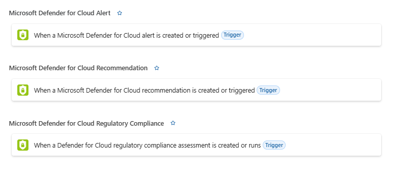

[🏠 전체 목차](./README.md)　·　**Part 3 · 운영 통합**　·　페이지 7 / 7

# 06 · 경고 알림 자동화 (이메일 · Teams · SMS · 티켓)

> [!NOTE]
> **이 페이지에서 얻는 것**
> - 보안 경고가 발생했을 때 **이메일·SMS·Teams·Slack·티켓**으로 알림을 내보내는 방법
> - 기본 제공 **이메일 알림**(간단) vs **워크플로 자동화**(Logic Apps, 유연) 차이
> - 조건 필터링(특정 심각도·키워드만) 및 Sentinel Playbook과의 관계
>
> ⏱️ 예상 소요 **10분**　·　🎯 대상: SOC 운영자, 보안 자동화 담당, 플랫폼 엔지니어

경고가 떴을 때 **누구에게, 어떤 채널로, 어떤 조건에서** 알릴지 자동화하는 방법을 정리합니다. Defender for Cloud는 **① 기본 이메일 알림**(빠른 설정)과 **② 워크플로 자동화**(Logic Apps 기반, 멀티채널·커스텀) 두 계층을 제공합니다.

---

## 1. 기본 이메일 알림 (가장 빠른 설정)

별도 구성 없이 **심각도 임계값 + 수신자**만 지정하면 이메일이 발송됩니다. 기본값으로 **구독 소유자는 High 심각도 경고·공격 경로 알림을 받습니다.**

**설정 절차**
1. Azure 포털 → **Microsoft Defender for Cloud** → **환경 설정** → 구독 선택
2. **이메일 알림(Email notifications)** 선택
3. **수신자 지정** — Azure 역할(Owner·AccountAdmin 등) 선택 또는 이메일 주소 직접 입력(개수 제한 없음, 쉼표 구분)
4. **알림 종류 선택**:
   - 경고: **"다음 심각도 이상 알림"** → 심각도 선택
   - 공격 경로: **"다음 위험 수준 이상 알림"** → 위험 수준 선택
5. 저장

- 권한: **Security Admin · 구독 Owner · Contributor**
- REST API(`securityContacts`)로도 구성 가능 — `emails`, `notificationsByRole`, `alertNotifications.minimalSeverity`, `phone` 필드.

> [!IMPORTANT]
> **알림 피로 방지를 위한 이메일 빈도 제한**이 있습니다(주소당):
>
> | 유형 | 수준 | 발송량 |
> | --- | --- | --- |
> | 경고 | High / Medium / Low | 하루 4통 / 2통 / 1통 |
> | 공격 경로 | Critical / High / Medium / Low | 30분 1통 / 1시간 1통 / 2시간 1통 / 3시간 1통 |
>
> 즉 폭주하는 경고를 실시간·전량으로 받으려면 기본 이메일이 아니라 **워크플로 자동화**(빈도 제한 없음)를 써야 합니다.

참고: [이메일 알림 설정](https://learn.microsoft.com/en-us/azure/defender-for-cloud/configure-email-notifications)

---

## 2. 워크플로 자동화 (Logic Apps) — 멀티채널 · 커스텀

경고·권장사항·규정 준수 변경 시 **Consumption Logic App을 자동 트리거**하는 기능입니다. 이메일뿐 아니라 **Teams·Slack·SMS·티켓**까지 원하는 채널로, 원하는 조건에서 보낼 수 있습니다.

### 트리거 3종

| 트리거 | 시점 |
| --- | --- |
| **When a Microsoft Defender for Cloud alert is created or triggered** | 보안 경고 발생 시(심각도 필터 가능) |
| **When a Microsoft Defender for Cloud recommendation is created or triggered** | 권장사항 생성·갱신 시 |
| **When a Defender for Cloud regulatory compliance assessment is created or runs** | 규정 준수 평가 생성·실행 시 |

<small class="cap">Logic App 디자이너에서 선택하는 Defender for Cloud 트리거 — 경고·권장사항·규정 준수 각각의 "created or triggered" 트리거</small>

> [!WARNING]
> 레거시 트리거 **"When a response to a Microsoft Defender for Cloud alert is triggered"** 는 더 이상 지원되지 않습니다(워크플로 자동화 기능에서 작동 안 함). 위 세 트리거 중 하나를 사용하세요.

### 설정 절차

1. Defender for Cloud → **Workflow automation** → **Add workflow automation**
2. 이름·설명 입력 → **트리거 조건 지정**(예: 경고 이름에 `SQL` 포함 시)
3. 트리거 충족 시 실행할 **Logic App 선택**
4. **Actions** → **visit the Logic Apps page**로 이동해 Logic App 생성(보안 카테고리 템플릿 또는 커스텀 플로우)

- 권한: **Security Admin 또는 리소스 그룹 Owner** + Logic App 역할(**Contributor**=생성·편집, **Operator**=실행만)
- 대규모: **Azure Policy(DeployIfNotExists)** 로 관리 그룹 전체 배포(경고용·권장사항용·규정준수용 정책 각각 존재)

> [!NOTE]
> Logic App이 드롭다운에 뜨려면 **Defender for Cloud 커넥터**를 포함해야 합니다. 커스텀 스키마가 필요하면 generic **HTTP** 커넥터 + [데이터 타입 스키마](https://aka.ms/ASCAutomationSchemas)를 씁니다.

### 알림 채널 — Logic Apps 커넥터

경고 트리거 뒤에 아래 채널 Action을 자유롭게 조합합니다(1,400+ 커넥터).

| 채널 | 커넥터 · 방법 |
| --- | --- |
| **이메일** | **Office 365 Outlook** — "Send an email (V2)". 경고 JSON 필드를 본문에 동적 매핑 |
| **Microsoft Teams** | **Teams** 커넥터 — "Post a message in a chat or channel". 보안 채널에 **Adaptive Card**로 경고 요약 게시 |
| **Slack** | **Slack** 커넥터 — OAuth 연결 후 특정 채널에 "Post message" |
| **SMS(문자)** | **Azure Communication Services** 또는 **Twilio** 커넥터 — 전화번호로 SMS 발송(Twilio는 Account SID + Auth Token 필요) |
| **티켓(ITSM)** | **ServiceNow** · **Jira** 커넥터 — 인시던트/이슈 자동 생성(양방향 동기화 지원) |
| **커스텀** | **HTTP** 액션 — 사내 시스템·SOAR·웹훅에 POST |

### 조건 필터링

- **심각도 필터** — 경고 트리거에서 High/Medium/Low/Informational 중 원하는 레벨만
- **키워드 필터** — 경고 이름·설명에 특정 문자열(예: `SQL`) 포함 시만 실행
- Logic App 내부에서 **Condition·Switch** 컨트롤로 경고 JSON 필드(`severity`·`alertType`·`compromisedEntity`)를 기준으로 채널 분기(예: High는 SMS+Teams, Medium은 이메일만)

참고: [워크플로 자동화](https://learn.microsoft.com/en-us/azure/defender-for-cloud/workflow-automation) · [Azure Logic Apps 개요](https://learn.microsoft.com/en-us/azure/logic-apps/logic-apps-overview)

---

## 3. 기본 이메일 vs 워크플로 자동화 — 선택 기준

| 항목 | 기본 이메일 알림 | 워크플로 자동화(Logic Apps) |
| --- | --- | --- |
| 설정 난이도 | 매우 간단(임계값+수신자) | 중간(Logic App 구성) |
| 채널 | **이메일 전용** | 이메일·Teams·Slack·SMS·티켓·웹훅 |
| 수신자 | 이메일 주소 / Azure 역할 | 임의의 채널·시스템 |
| 조건 | 심각도 임계값 | 심각도 + 키워드 + 커스텀 분기 |
| **빈도 제한** | **있음**(하루 몇 통) | **없음**(발생 즉시) |
| 메시지 포맷 | 고정 | 완전 커스텀(경고 필드 참조) |
| 자동 대응 | 불가 | 가능(격리·차단·티켓 등 조치 연계) |

**권장**: 초기엔 **기본 이메일**로 빠르게 통보를 켜고, **폭주 대응·멀티채널·티켓 연동·조건 분기·자동 조치**가 필요해지면 **워크플로 자동화**로 확장하세요.

---

## 4. Microsoft Sentinel Playbook과의 관계

Sentinel을 함께 쓴다면, 알림·대응 자동화를 **Sentinel Playbook**(Logic App)으로도 할 수 있습니다.

| | Defender for Cloud 워크플로 자동화 | Sentinel Playbook |
| --- | --- | --- |
| 트리거 | Defender for Cloud가 직접(경고·권장사항·규정준수) | **Analytics Rule → Automation Rule → Playbook** 연쇄 |
| 범위 | Defender for Cloud 신호 특화 | Sentinel 인시던트 전체(모든 소스) |
| 컨텍스트 | 경고 JSON | 인시던트·엔티티 매핑·UEBA·TI 등 풍부 |

- Defender for Cloud 경고는 **Sentinel 커넥터**로 스트리밍되므로, 같은 경고가 **양쪽에서 모두 트리거되면 중복 알림**이 날 수 있습니다. → 어느 계층이 자동화를 담당할지 **명확히 나누세요**(예: 단순 통보는 MDC, 복합 대응은 Sentinel).
- Sentinel Playbook 추가 권한: **Sentinel Contributor**(규칙에 연결)·**Playbook Operator**(수동 실행)·**Automation Contributor**(자동 실행).

참고: [Sentinel Playbook 자동 대응](https://learn.microsoft.com/en-us/azure/sentinel/automate-responses-with-playbooks)

---

## 한눈에 — 무엇을 언제 쓰나

| 목표 | 방법 |
| --- | --- |
| 빠르게 담당자에게 **이메일 통보** | **기본 이메일 알림**(심각도 임계값) |
| **Teams·SMS·Slack·티켓** 등 멀티채널 | **워크플로 자동화**(Logic Apps 커넥터) |
| **특정 심각도·키워드만** 알림 | 워크플로 자동화 트리거 조건 필터 |
| 알림 + **자동 대응**(격리·차단·티켓) | 워크플로 자동화 또는 Sentinel Playbook |
| Sentinel 인시던트 기반 복합 대응 | **Sentinel Playbook**(Analytics→Automation Rule) |

---

## 참고 링크

- [이메일 알림 설정](https://learn.microsoft.com/en-us/azure/defender-for-cloud/configure-email-notifications) · [Security contacts REST API](https://learn.microsoft.com/en-us/rest/api/defenderforcloud-composite/security-contacts)
- [워크플로 자동화](https://learn.microsoft.com/en-us/azure/defender-for-cloud/workflow-automation) · [Azure Logic Apps 개요](https://learn.microsoft.com/en-us/azure/logic-apps/logic-apps-overview)
- [Sentinel Playbook](https://learn.microsoft.com/en-us/azure/sentinel/automate-responses-with-playbooks) · [보안 경고 개요](https://learn.microsoft.com/en-us/azure/defender-for-cloud/alerts-overview)

---

| ◀ 이전 | ▶ 다음 |
| :-- | --: |
| [05 · 로그 내보내기 · 조회하기](05-log-export.md) | [🏠 전체 목차](./README.md) |

[🏠 전체 목차로 돌아가기](./README.md)
