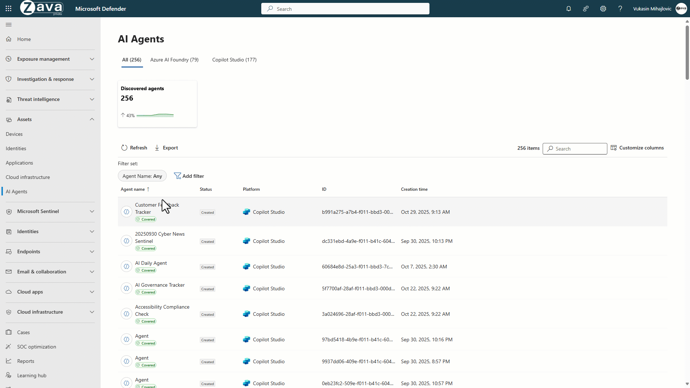
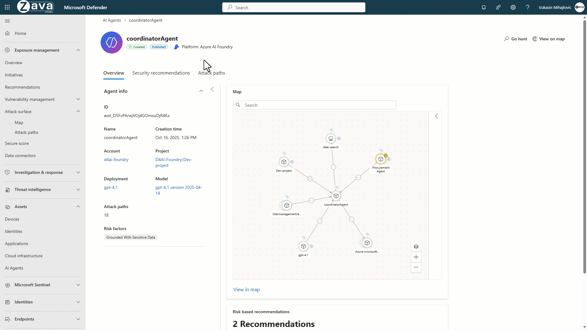

[🏠 전체 목차](README.md)　·　**Part 2 · 핵심 기능**　·　[04 · CWP](04-cwp.md)　·　**Defender for AI**

# Defender for AI

> [!NOTE]
> **보호 대상**: Azure OpenAI·Azure AI Foundry·Azure ML, Amazon Bedrock, Google Vertex AI, Copilot Studio 등에서 빌드된 **AI 앱·에이전트** — 빌드부터 런타임까지.
> Microsoft의 AI 보안도 **"안전하게 시작 → 안전하게 유지"** 로, ① AI 자산의 태세를 관리하고(AI-SPM) ② 실시간 위협을 탐지·대응하며(AI 위협 보호) ③ 관리 디바이스의 로컬 AI 에이전트까지 보호합니다.

> [!IMPORTANT]
> AI 태세(AI-SPM)는 **Defender CSPM**, AI 위협 보호는 워크로드 플랜에 해당합니다. AI 위협 보호는 현재 **텍스트 토큰**을 스캔하며 **상용 클라우드 전용**(Azure Government·21Vianet·AWS 연결 계정 미지원)입니다. 30일 체험(월 750억 토큰 캡), 활성화에 구독 Owner 필요.

## ① AI 보안 태세 관리 (AI-SPM)

### 종합 AI 가시성

Microsoft Foundry·Copilot Studio·Azure ML·Amazon Bedrock·Vertex AI 전반의 **AI 모델·에이전트를 인벤토리화**합니다. 메타데이터, 에이전트 지침(instructions), 연결된 ID·에이전트 도구(MCP 등)를 함께 봅니다.

<small class="cap">플랫폼별(Foundry·Copilot Studio 등) 발견된 AI 에이전트와 메타데이터</small>

### 취약성 식별 · 수정

AI 구성 오류, 안전하지 않은 지침, 도구·에이전트에 대한 **과도한 권한**을 발견하고, AI 파이프라인·배포·서비스의 태세 문제를 권장사항으로 수정합니다.

### 위험 우선순위화 (공격 경로)

위험 컨텍스트로 우선순위를 정합니다 — 클라우드 리소스·에이전트·모델·데이터 간 관계를 시각화한 **공격 경로 분석**으로, AI 자산으로 이어지는 직접·간접 악용 경로를 찾습니다.

<small class="cap">클라우드 리소스·에이전트·모델·데이터 관계 기반 AI 공격 경로</small>

## ② AI 위협 보호

### 악의적 활동 모니터링

의심스러운 **AI 모델 상호작용·에이전트 도구 호출·메모리 변경·LLM 호출**을 탐지합니다.

<small class="cap">탈옥·의심 도구 호출 등 AI 활동을 탐지·조사</small>

### 실시간 탐지 · 대응

- **AI 모델 경고** — 탈옥(Jailbreak), 민감 데이터 노출, 자격 증명 도난
- **에이전트 특화 위협** — 의도 조작(intent breaking), 목표 하이재킹(goal manipulation), 도구 오용, 권한 상승
- **탐지 방식** — 의심 콘텐츠(프롬프트·응답의 악성 URL·시크릿·인코딩/조작)와 의심 행위(사용자/에이전트·앱·도구 행동)를 계층 방어로 탐지(Microsoft 위협 인텔리전스 기반)

### 상관 · 컨텍스트화 (Defender XDR·SIEM)

경고를 **인시던트로 상관**해 무엇이 공격받고 어떻게 확산됐는지, 어떤 도구·ID가 관여했는지 전체 맥락으로 조사합니다. 프롬프트·응답 증거, 애플리케이션·사용자 컨텍스트, **그라운딩 매핑**(모델이 참조한 데이터 출처), CNAPP 태세 컨텍스트를 제공합니다.

<small class="cap">탈옥·프롬프트 인젝션 경고를 인시던트 그래프로 상관·조사</small>

### Foundry 가드레일 통합

Azure AI Content Safety **Prompt Shields**가 앱에서 탈옥·프롬프트 공격을 차단하고, Defender가 그 탐지·앱 컨텍스트·위협 인텔리전스를 수집해 **컨텍스트 보안 경고**를 생성합니다. 대응 위협: 직접/간접 프롬프트 인젝션(UPIA/XPIA), 무단 접근, DoS·월렛 남용, 민감 데이터 유출, 학습 데이터 포이즈닝, 모델 탈취.

## ③ 엔드포인트 AI 보안 (로컬 에이전트)

- **로컬 AI 에이전트 발견** — 관리 디바이스의 로컬 AI 에이전트를 Defender 포털 자산으로 표시(코딩 CLI·에이전틱 IDE·데스크톱 AI 어시스턴트·로컬 AI 런타임). 실행 방식·사용자·디바이스·프로세스 가시성.
- **실시간 차단** — 에이전트가 읽는 콘텐츠에 숨겨진 악성 지침을 **인라인 런타임 보호**로 차단, 사용자에게 알림·로깅, SOC에 상세 경고(예: 의심스러운 AI 프롬프트 인젝션).
- **조사** — 에이전트 관계를 쿼리해 블래스트 반경(디바이스·ID·MCP 서버·멀티클라우드 리소스)을 파악, KQL로 위험 구성(자동 승인 모드+프로덕션 접근 등) 헌팅, 헌팅 쿼리를 탐지 규칙으로 승격.

---

## 참고 링크

- [AI 위협 보호](https://learn.microsoft.com/en-us/azure/defender-for-cloud/ai-threat-protection)
- [AI 보안 태세 관리(AI-SPM)](https://learn.microsoft.com/en-us/azure/defender-for-cloud/ai-security-posture) · [생성형 AI 앱 위협 보호 사용](https://learn.microsoft.com/en-us/azure/defender-for-cloud/gain-end-user-context-ai)

---

### 다음 읽을거리

| ◀ 이전 | ▶ 다음 |
| :-- | --: |
| [APIs](cwp-apis.md) | [04 · CWP 개요](04-cwp.md) |

[🏠 전체 목차로 돌아가기](README.md)
