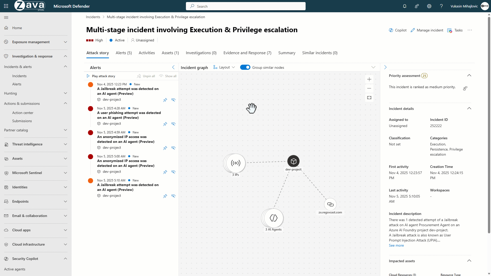
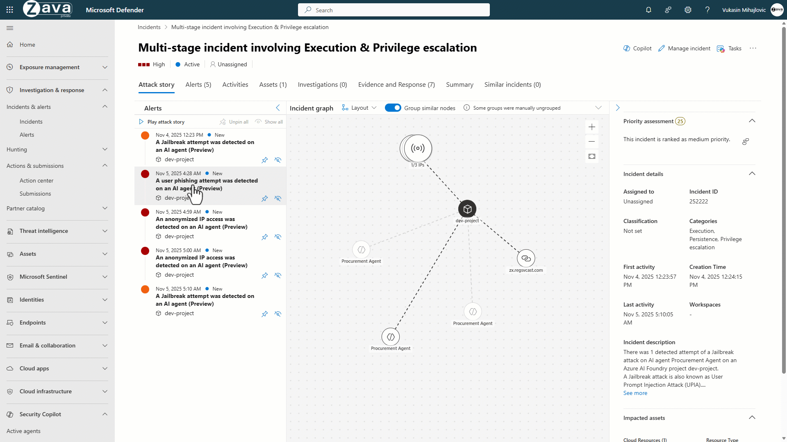

[🏠 전체 목차](README.md)　·　**Part 2 · 핵심 기능**　·　[04 · CWP](04-cwp.md)　·　**Defender for AI Services**

# Defender for AI Services

> [!NOTE]
> **보호 대상**: **Azure OpenAI** 및 **Azure AI Model Inference** 서비스에 배포된 생성형 AI 모델의 **런타임 위협** — 현재 **텍스트 토큰**만 스캔(이미지·오디오 토큰 미지원).
> 이 플랜은 실행 중인 AI 앱을 **실시간으로 보호**합니다. Azure AI Content Safety **Prompt Shields**와 **Microsoft 위협 인텔리전스**를 결합해 탈옥·프롬프트 인젝션·민감 데이터 노출·자격 증명 도난 등을 탐지하고, Defender XDR·SIEM으로 대응합니다.
>
> ⏱️ 예상 소요 **6분**

> [!IMPORTANT]
> - **AI 태세 관리(AI-SPM)** — AI 자산 인벤토리, 취약성·구성 오류, AI 공격 경로 분석은 이 플랜이 아니라 **Defender CSPM** 소관입니다. → [03 · CSPM §11 AI-SPM](03-cspm.md) 참조.
> - **가용성** — **상용 클라우드 전용**(Azure Government·21Vianet·연결된 AWS 계정 미지원). **30일 무료 체험**(체험 기간 통틀어 **750억 토큰** 캡 — 30일 이내라도 캡 도달 시 과금 시작). 구독 수준 활성화에 **Owner** 역할 필요.

## ① 실시간 위협 탐지 (Activity monitoring)

의심스러운 **AI 모델 상호작용·에이전트 도구 호출·메모리 변경·LLM 호출**을 실시간 모니터링해 보안 경고를 생성합니다. 별도 로깅 설정이 필요 없습니다.

<small class="cap">탈옥·의심 도구 호출 등 AI 활동을 탐지·조사</small>

### 탐지 범위 — 콘텐츠와 행위 두 계층

Microsoft 위협 인텔리전스 기반으로 프롬프트·응답의 **의심 콘텐츠**와 사용자·앱·도구의 **의심 행위**를 함께 봅니다.

- **의심 콘텐츠** — 탈옥(악의적 의도), 시크릿·민감 데이터, 악성 URL, 인코딩·조작(예: ASCII 스머글링)
- **의심 행위** — 사용자·에이전트 행위, 애플리케이션 행위, 도구 행위, 접근 파라미터(Tor·의심 IP·의심 User-Agent)

### 주요 AI 모델 경고

| 경고 범주 | 예시 |
| --- | --- |
| **탈옥(Jailbreak)** | Prompt Shields가 **차단**한 시도 / 탐지했으나 **미차단**된 시도(콘텐츠 필터 설정·낮은 신뢰도) |
| **프롬프트 인젝션** | 직접(UPIA)·간접(XPIA), ASCII 스머글링 |
| **민감 데이터·자격 증명** | 민감 데이터 노출, 자격 증명 도난 |
| **악성 URL** | 모델 응답의 피싱 URL, AI 앱 내 피싱 URL 공유 |
| **월렛 남용(DoW)** | 반복 요청·볼륨 이상 기반 지갑 공격(비용 남용) |
| **비정상 접근** | Tor·의심 IP·의심 서비스 주체 호출·접근 이상 |

<small class="cap">탈옥·민감 데이터 노출 등 AI 모델 경고를 심각도·증거와 함께 조회</small>

> [!NOTE]
> **에이전트 특화 위협**(의도 조작 intent breaking, 목표 하이재킹 goal manipulation, 도구 오용, 권한 상승)은 덱에 제시된 방향으로, 일부는 **미리 보기/로드맵** 단계입니다. 현재 GA 경고 카탈로그는 [AI 워크로드 경고 참조](https://learn.microsoft.com/en-us/azure/defender-for-cloud/alerts-ai-workloads)에서 확인하세요.

## ② 인시던트 상관 · 조사 (Defender XDR · SIEM)

경고를 **인시던트로 상관**해 무엇이 공격받고 어떻게 확산됐는지, 어떤 도구·ID가 관여했는지 전체 맥락으로 조사합니다. AI 워크로드 경고는 **Defender XDR 포털로 중앙화**되고, **Microsoft Sentinel 등 SIEM으로 내보내기**할 수 있습니다.

<small class="cap">탈옥·프롬프트 인젝션 경고를 인시던트 그래프로 상관·조사</small>

### 풍부한 조사 컨텍스트

경고에는 다음 증거가 포함됩니다 — **프롬프트·응답 증거**, 애플리케이션 컨텍스트, **그라운딩 매핑**(모델이 참조한 데이터 출처), CNAPP 태세 컨텍스트.

### 최종 사용자 컨텍스트 (UserSecurityContext)

개발자가 Azure OpenAI API 호출에 **`UserSecurityContext`** 파라미터(EndUserId·SourceIP·applicationName)를 추가하면, 경고를 **사용자·IP 단위로 상관**하고 특정 사용자를 차단할 수 있습니다.

> [!TIP]
> `UserSecurityContext`는 **Azure OpenAI REST API 직접 호출**에만 적용되며, **Azure AI Model Inference API로 배포된 모델에는 지원되지 않습니다**. REST API(2025-01-01)·.NET·Python·JS·Go SDK에서 사용할 수 있습니다.

## ③ Foundry 가드레일 통합

Azure AI Content Safety **Prompt Shields**가 앱에서 탈옥·프롬프트 공격을 **차단**하고, Defender가 그 탐지·앱 컨텍스트·위협 인텔리전스를 수집해 **컨텍스트 보안 경고**를 생성합니다(자동 대응 흐름 포함). 대응 위협: 직접·간접 프롬프트 인젝션(UPIA/XPIA), 무단 접근, DoS·월렛 남용, 민감 데이터 유출, 학습 데이터 포이즈닝, 모델 탈취.

---

> [!NOTE]
> **관리 디바이스의 로컬 AI 에이전트 보호**(코딩 CLI·에이전틱 IDE·데스크톱 AI 어시스턴트·로컬 AI 런타임 발견, 인라인 런타임 차단)는 Defender for Cloud가 아니라 **Defender XDR 엔드포인트 보안** 및 [Microsoft Agent 365](https://learn.microsoft.com/en-us/microsoft-agent-365/overview) 소관입니다.

## 참고 링크

- [AI 위협 보호](https://learn.microsoft.com/en-us/azure/defender-for-cloud/ai-threat-protection) · [AI 워크로드 경고 참조](https://learn.microsoft.com/en-us/azure/defender-for-cloud/alerts-ai-workloads)
- [최종 사용자 컨텍스트 확보](https://learn.microsoft.com/en-us/azure/defender-for-cloud/gain-end-user-context-ai) · [AI 위협 보호 사용 설정](https://learn.microsoft.com/en-us/azure/defender-for-cloud/ai-onboarding)
- [AI 보안 태세(AI-SPM) — CSPM](https://learn.microsoft.com/en-us/azure/defender-for-cloud/ai-security-posture)

---

### 다음 읽을거리

| ◀ 이전 | ▶ 다음 |
| :-- | --: |
| [APIs](cwp-apis.md) | [04 · CWP 개요](04-cwp.md) |

[🏠 전체 목차로 돌아가기](README.md)
