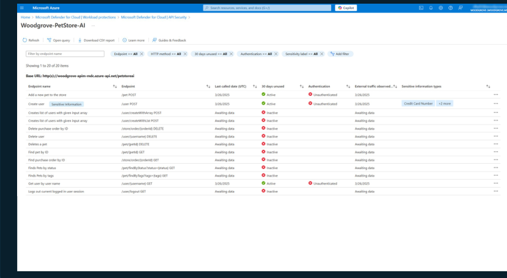
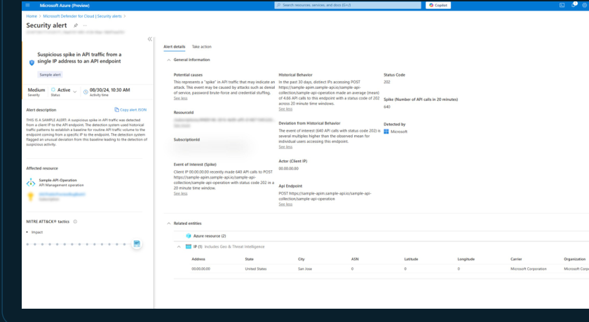

[🏠 전체 목차](README.md)　·　**Part 2 · 핵심 기능**　·　[04 · CWP](04-cwp.md)　·　**Defender for APIs**

# Defender for APIs

> [!NOTE]
> **보호 대상**: **Azure API Management**에 게시된 **REST API**. (현재 REST만 지원, self-hosted gateway·API Management workspaces는 온보딩 제외.)
> API는 가장 빈번한 공격 벡터입니다. Defender for APIs는 **발견 → 강화 → 런타임 보호 → DevOps 사전 테스트** 4단계로 API를 보호합니다.
>
> ⏱️ 예상 소요 **5분**

> [!TIP]
> **공격 경로 분석**(백엔드 워크로드·데이터·AI 앱으로의 측면 이동·데이터 유출 경로)은 **Defender CSPM**의 Cloud Security Graph 기능입니다. Defender for APIs를 CSPM과 함께 켜면 조직 전반의 API 노출 위험을 그래프로 분석할 수 있습니다. → [03 · CSPM](03-cspm.md)

## ① API 발견 · 태세 이해

- **가시성 향상** — Azure API Management에 게시된 API를 **통합 대시보드**(API 컬렉션·엔드포인트·서비스별)로 발견.
- **API 위험 선제 완화** — 외부·휴면(30일 미사용)·미인증 API를 식별하고, 위험 컨텍스트로 수정 우선순위화.
- **민감 데이터 분류** — 민감 데이터를 주고받는 API를 분류하고, 위험 우선순위화에 반영.

<small class="cap">엔드포인트별 인증 상태·30일 미사용·민감 정보 유형을 한눈에</small>

## ② 구성 강화 · 위험 우선순위화

- **보안 권장사항** — 위험에 노출된 API 표면을 강화하는 권장사항을 검토·적용.
- **애플리케이션 위험 수정** — 측면 이동·데이터 유출로 이어지는 API 주도 위험 해소.
- **MITRE 매핑** — 전체 **MITRE ATT&CK 킬체인** 매핑으로 API 공격 표면 가시성 확보.

## ③ 런타임 위협 탐지 · 대응

- **OWASP API Top 10 커버리지** — 상위 OWASP API 위협을 지속 탐지·대응.
- **ML·룰 기반 이상 탐지** — 트래픽 모니터링·위협 인텔리전스로 활성 API 위협·의심 사용 패턴을 통합 뷰로.
- **SIEM 통합** — Microsoft Sentinel 등과 연동해 SOC가 API 인시던트를 신속 분류.

대표 시나리오: **누출(leaky) API** — 공개·미인증 API의 민감 데이터 노출을 태세 관리로 사전 식별하고, 페이로드 급증 등 이상을 경고로 탐지. **깨진 개체 수준 인가(BOLA)** — 사용자 ID 열거(예: `/userId/12/accountdetails` … `/99/…`) 같은 파라미터 열거를 행위 이상으로 탐지.

<small class="cap">단일 IP의 API 트래픽 급증 등 이상을 MITRE 매핑 경고로 조사</small>

## ④ DevOps 사전 스캔

- **API 사전 테스트·강화** — CI/CD 파이프라인에서 정적·동적 테스트로 **OWASP API 위협**과 **OpenAPI 명세 모범 사례**에 대비해 API를 사전 강화.
- **파트너 솔루션 연동** — Azure Marketplace 파트너 솔루션 결과를 Defender for Cloud로 통합.

## 과금 모델

구독 수준에서 **월간 모니터링된 API 트래픽(호출 수)** 기준으로 과금됩니다. **5단계 요금제**가 있으며 각 플랜의 엔타이틀먼트 한도가 다릅니다. 기본은 **Plan 1**(월 100만 호출 한도)이므로, 트래픽이 많은 구독은 상위 플랜 선택으로 초과 과금을 방지하세요.

---

## 참고 링크

- [Defender for APIs 개요](https://learn.microsoft.com/en-us/azure/defender-for-cloud/defender-for-apis-introduction)
- [Defender for APIs 배포·요금제](https://learn.microsoft.com/en-us/azure/defender-for-cloud/defender-for-apis-deploy) · [API 경고 참조](https://learn.microsoft.com/en-us/azure/defender-for-cloud/alerts-api)

---

### 다음 읽을거리

| ◀ 이전 | ▶ 다음 |
| :-- | --: |
| [Containers](cwp-containers.md) | [AI Services →](cwp-ai.md) |

[🏠 전체 목차로 돌아가기](README.md)
