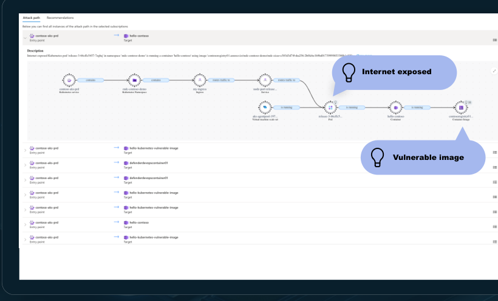
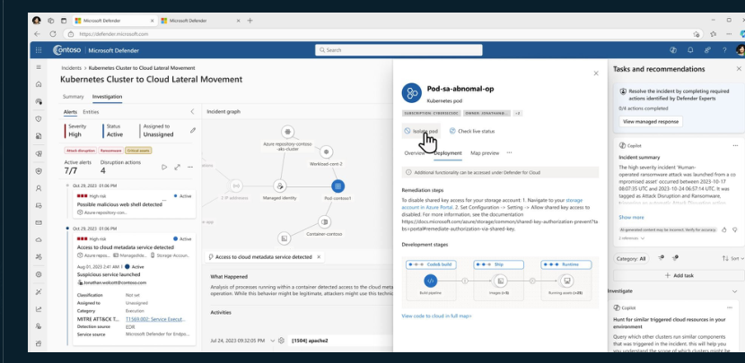

[🏠 전체 목차](README.md)　·　**Part 2 · 핵심 기능**　·　[04 · CWP](04-cwp.md)　·　**Defender for Containers**

# Defender for Containers

> [!NOTE]
> **보호 대상**: Kubernetes 클러스터·노드·워크로드·레지스트리·이미지 — AKS·EKS·GKE·Arc K8s.
> **코드에서 런타임까지** 컨테이너 수명 주기 전 단계를 보호합니다. 빌드 시 스캔·게이팅으로 안전한 이미지를 배포하고, 런타임에서 위협을 탐지·차단하며, Defender XDR로 조사·대응합니다.

## ① 안전한 공급망 (빌드 시)

### 빌드 시 이미지 스캔 · 게이팅

- **조기 스캔** — CI/CD 파이프라인(Azure·서드파티)을 CLI 도구로 스캔해 취약 이미지를 조기에 탐지·차단.
- **레지스트리 스캔** — 퍼블릭 클라우드·서드파티 레지스트리(ACR·ECR·GAR/GCR·Docker Hub·JFrog) 이미지 스캔.
- **SDLC 이미지 진행 제어** — 클러스터 관리자를 위한 파이프라인 전반의 중앙 뷰(AKS), 고위험 구성 오류 **차단**·배포 시 보안 정책 강제(게이팅).
- **코드 투 클라우드 추적** — 런타임 위험·레지스트리 취약성을 소스 코드까지 역추적해 정밀 수정, 실제 악용 가능성(exploitability) 기반 권장사항 제공.

## ② 태세 관리 (에이전트리스)

### 발견 · 위험 평가 · 컴플라이언스

- **종합 가시성·발견** — 에이전트리스로 Kubernetes·레지스트리 자산을 제로 풋프린트로 탐색.
- **위험 평가·모니터링** — 에이전트리스 취약성 평가(레지스트리 이미지·실행 컨테이너·노드), 클라우드 보안 그래프에 반영해 컨텍스트 위험·공격 경로 계산.
- **컴플라이언스·수정** — 보안 탐색기의 기본/커스텀 쿼리로 태세 위험 헌팅, 실행 가능한 수정 가이드.

<small class="cap">인터넷 노출 → 취약 이미지까지의 컨테이너 공격 경로를 시각화</small>

## ③ 런타임 위협 방어 (센서)

### 탐지 · 조사 · 대응 (Defender XDR 통합)

- **클라우드 네이티브 위협 탐지** — Microsoft 위협 인텔리전스 기반 **eBPF 센서**로 Kubernetes 스택 전반의 위협 탐지. 60+ K8s 인식 분석, **MITRE ATT&CK for Containers** 매핑.
- **심층 조사** — 클라우드 제공자·프로세스 데이터로 인시던트 근본 원인 추적, 인시던트 그래프.
- **신속 대응** — 침해된 파드를 **격리·종료**해 무단 접근·측면 이동을 즉시 차단.
- **바이너리 드리프트 탐지·차단** — 이미지에 없던 비인가 프로세스 탐지·차단.

<small class="cap">K8s 인시던트 그래프·경고를 Defender XDR에서 조사, 파드 격리 등 대응</small>

## 플랜 구성

| | Defender CSPM (에이전트리스) | Defender for Containers (에이전트리스 + 센서) |
| --- | :---: | :---: |
| K8s·레지스트리 에이전트리스 발견 | ✅ | ✅ |
| 빌드 시 이미지 스캔 · 코드 투 클라우드 매핑 | ✅ | ✅ |
| 클라우드 보안 탐색기(위험 헌팅) · 공격 경로 | ✅ | ✅ |
| 에이전트리스 취약성 평가 | ✅ | ✅ |
| **런타임 위협 탐지**(드리프트·심층 OS 가시성) | ❌ | ✅ |
| **관리 계층 에이전트리스 런타임 탐지** | ❌ | ✅ |
| **K8s 구성 오류 식별·차단**(Azure Policy) | ❌ | ✅ |
| **CDR** — 런타임 위협·인시던트 조사·대응 | ❌ | ✅ |

- 센서 기반 추가 기능: **안티맬웨어**, **DNS 탐지**. AKS는 GA, **Arc K8s 센서는 Preview**. 취약성 발견 결과는 **Microsoft 인증서로 서명**됩니다.

---

## 참고 링크

- [Defender for Containers 개요](https://learn.microsoft.com/en-us/azure/defender-for-cloud/defender-for-containers-introduction)
- [컨테이너 아키텍처](https://learn.microsoft.com/en-us/azure/defender-for-cloud/defender-for-containers-architecture) · [이미지 취약성 평가](https://learn.microsoft.com/en-us/azure/defender-for-cloud/agentless-vulnerability-assessment-azure)
- [Kubernetes 경고 참조](https://learn.microsoft.com/en-us/azure/defender-for-cloud/alerts-containers)

---

### 다음 읽을거리

| ◀ 이전 | ▶ 다음 |
| :-- | --: |
| [Databases](cwp-databases.md) | [APIs →](cwp-apis.md) |

[🏠 전체 목차로 돌아가기](README.md)
