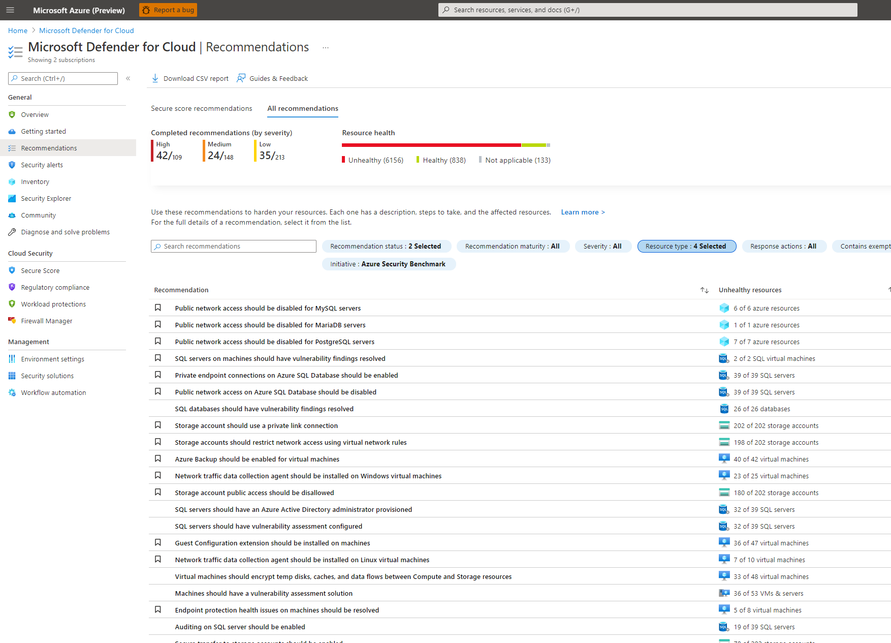
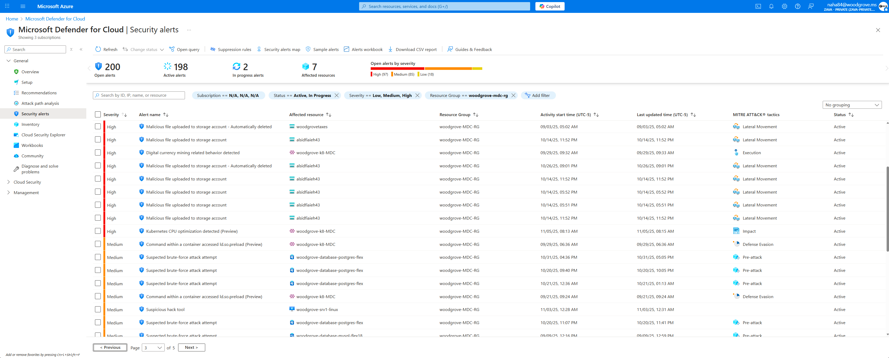

[🏠 전체 목차](README.md)　·　**Part 2 · 핵심 기능**　·　[03 · CWP](03-cwp.md)　·　**Defender for Databases**

# Defender for Databases

> [!NOTE]
> **보호 대상**: Azure SQL, 오픈소스 관계형 DB(PostgreSQL·MySQL), Azure Cosmos DB — PaaS·IaaS·멀티클라우드(Azure·AWS·GCP·온프렘) 전반.
> Defender for Databases는 데이터베이스의 **취약성**을 사전에 찾아 수정하고(**예방**), 런타임 **위협을 탐지·대응**합니다. 프레임워크는 **활성화(원클릭) → 예방(취약성 평가) → 탐지 → 대응(경고·자동화)** 입니다.
>
> ⏱️ 예상 소요 **6분**

> [!TIP]
> 섀도우 DB 발견, **공격 경로 분석**, 위험 우선순위화, 리소스 수준 **민감 데이터 인사이트**는 이 플랜이 아니라 **Defender CSPM / DSPM** 소관입니다. → [02 · CSPM](02-cspm.md) 참조. Defender for SQL과 함께 켜면 데이터베이스 컨텍스트가 더해집니다.

## ① 취약성 평가 (Defender for Azure SQL)

잠재적 DB 취약성·구성 오류를 검색·추적·수정합니다. **Azure SQL 전용**(SQL Database·Managed Instance·Synapse) 기능으로, 오픈소스 관계형 DB·Cosmos DB에는 제공되지 않습니다.

- **Express 구성**(기본·권장) — Microsoft가 스토리지를 관리, 별도 Storage 계정 불필요, 상시 스캔. Azure SQL DB·MI·Synapse 지원.
- **Classic 구성** — 고객 관리형 Storage 계정 필요, 주기 스캔 ON/OFF 설정 가능.

<small class="cap">MySQL/PostgreSQL·SQL 서버의 권장사항과 비정상 리소스 수를 확인</small>

## ② 위협 탐지 · 대응

### 조기 침해 징후 탐지

- **접근 이상(ML)** — 비정상 위치·의심 IP·데이터센터/도메인 이상, 의심 앱, 주체 이상 등
- **브루트포스 탐지** — 반복 로그인 시도(유효 사용자 대상·성공/실패 분리)
- **쿼리 이상** — 잠재적 **SQL 인젝션**, 스크립트 실행(난독화·비정상 외부 소스), IMDS 엔드포인트 의심 접근
- **측면 이동** — 침해된 워크로드에서 DB로의 이동
- **데이터 유출** — 비정상 규모의 데이터 추출
- Microsoft 위협 인텔리전스로 지속 업데이트, **MITRE ATT&CK 매핑**(Initial access·Execution·Persistence·Privilege escalation·Defense evasion·Credential access·Discovery·Lateral movement·Collection·C2·Exfiltration·Impact) 경고 제공

<small class="cap">브루트포스·악성 업로드 등 경고를 MITRE ATT&CK 전술과 함께 조회</small>

### 통합 대응

경고는 **Microsoft Sentinel(SIEM)**, **Defender XDR**, **Security Copilot**에 네이티브 통합됩니다. 경고 증거 기반 조사와 **이메일 알림·Jira·Slack·Teams** 등 자동화 워크플로로 신속 대응합니다.

## 하위 플랜별 상세

### Defender for Azure SQL Databases

- **대상**: Azure SQL DB·탄력적 풀·관리형 인스턴스·Synapse 전용 SQL 풀, SQL Server **2012·2014·2016·2017·2019·2022**(Azure VM·Arc·AWS EC2·AWS RDS Custom·GCP GCE·온프렘 포함).
- **기능**: 취약성 평가(PaaS·IaaS) + 위협 방어 — SQL 인젝션, 브루트포스(성공/실패 분리), 침해 머신의 의심 접근.

### Defender for Open-Source Relational Databases

- **대상**: Azure Database for PostgreSQL/MySQL Flexible Server(모든 티어), Amazon RDS의 MariaDB·MySQL·PostgreSQL(**Preview**).
- **탐지**: 이상 접근·쿼리 패턴(브루트포스), 침해 머신의 의심 활동. *PaaS만 지원, Arc 머신 미지원.*

### Defender for Azure Cosmos DB

- **대상**: Cosmos DB **NoSQL API 전용**(Cassandra·MongoDB·Table·Gremlin 미지원).
- **탐지**: SQL 인젝션 변형, 이상 접근(Tor·악성 IP·비정상 위치), 의심스러운 키 목록 조회·데이터 추출. 계정 데이터에 직접 접근하지 않아 **성능 영향 없음**.

---

## 활성화 · 온보딩

> [!NOTE]
> 일반 활성화 절차는 [01 · 사전 준비](01-prerequisites.md)를 참고하세요. Databases 플랜 토글 하나로 **4개 하위 플랜이 함께** 켜집니다(`Select types`로 개별 선택도 가능). **오픈소스 관계형 DB·Cosmos DB는 토글만으로 완료**되고, 추가 설정이 필요한 것은 **SQL on Machines**와 **Azure SQL의 VA 구성**입니다.
### 공통 1단계 — 플랜 활성화

1. Azure 포털 → **Defender for Cloud** → **환경 설정** → 구독 선택
2. **Databases** 플랜 **On** → **Save** (권한: 구독 **Owner**)

토글 시 4개 하위 플랜(Azure SQL / SQL on Machines / 오픈소스 관계형 DB / Cosmos DB)이 활성화됩니다. 오픈소스 관계형 DB와 Cosmos DB는 여기서 **끝**입니다(PaaS, 에이전트 불필요). 필요 시 개별 DB 리소스의 **Security → Microsoft Defender for Cloud**에서 리소스 수준으로도 켤 수 있습니다.

### 2단계 — SQL Servers on Machines (IaaS/Arc)

1. `환경 설정 → Databases 플랜 → Settings`에서 **"Azure Monitoring Agent for SQL server on machines" 자동 프로비저닝** 토글 **On** → Continue → Save
2. 온프렘·AWS/GCP 머신은 **Azure Arc 온보딩이 선행**되어야 합니다(Arc SQL Server 인스턴스로 등록)
3. 다음 **확장이 차단되지 않도록** 확인: `AdvancedThreatProtection.Windows`(Defender for SQL), `SqlIaaSAgent`(IaaS)/`WindowsAgent.SqlServer`(Arc)
4. **아웃바운드 TCP 443**(TLS)을 `*.<region>.arcdataservices.com`으로 허용
5. **배포 확인** — 활성화 후 인스턴스 탐지·보호까지 최대 수 시간(약 30분+). 반드시 배포 상태를 검증

> [!WARNING]
> 레거시 **MMA(Log Analytics Agent)는 2024년 은퇴**했습니다. MMA 기반으로 설정돼 있으면 **AMA 자동 프로비저닝으로 마이그레이션**하고 기존 MMA 토글을 끄세요.
- 권한: 플랜 배포는 구독 **Owner**, SQL Server 서비스 계정은 각 인스턴스의 **sysadmin** 역할

### 3단계 — Azure SQL 취약성 평가(VA) 구성

- **Express(기본·권장)** — 플랜 활성화 시 **자동**. 별도 스토리지 계정이 필요 없고 상시 스캔됩니다(Azure SQL DB·MI·Synapse).
- **Classic(레거시)** — 전환하면 **① Storage 계정 지정 ② 정기 스캔 On/Off ③ 스캔 리포트 이메일 수신자**를 직접 구성해야 합니다.

> [!NOTE]
> Express ↔ Classic 전환 시 **기존 baseline·스캔 이력은 이전되지 않습니다.** VA 설정 변경 권한: Express는 **SQL Security Manager 또는 Security Admin**, Classic은 추가로 **Storage Blob Data Reader + 스토리지 계정 Owner** 필요.

참고: [Databases 플랜 활성화](https://learn.microsoft.com/en-us/azure/defender-for-cloud/tutorial-enable-databases-plan) · [SQL on machines](https://learn.microsoft.com/en-us/azure/defender-for-cloud/defender-for-sql-usage) · [AMA 자동 프로비저닝](https://learn.microsoft.com/en-us/azure/defender-for-cloud/defender-for-sql-autoprovisioning) · [SQL VA 구성](https://learn.microsoft.com/en-us/azure/defender-for-cloud/sql-azure-vulnerability-assessment-enable)

---

## 참고 링크

- [Defender for Azure SQL](https://learn.microsoft.com/en-us/azure/defender-for-cloud/defender-for-sql-introduction) · [SQL 취약성 평가](https://learn.microsoft.com/en-us/azure/defender-for-cloud/sql-azure-vulnerability-assessment-overview)
- [오픈소스 관계형 DB](https://learn.microsoft.com/en-us/azure/defender-for-cloud/defender-for-databases-introduction) · [Cosmos DB](https://learn.microsoft.com/en-us/azure/defender-for-cloud/concept-defender-for-cosmos)
- [SQL 경고 참조](https://learn.microsoft.com/en-us/azure/defender-for-cloud/alerts-sql-database-and-azure-synapse-analytics)

---

### 다음 읽을거리

| ◀ 이전 | ▶ 다음 |
| :-- | --: |
| [Storage](cwp-storage.md) | [Containers →](cwp-containers.md) |

[🏠 전체 목차로 돌아가기](README.md)
