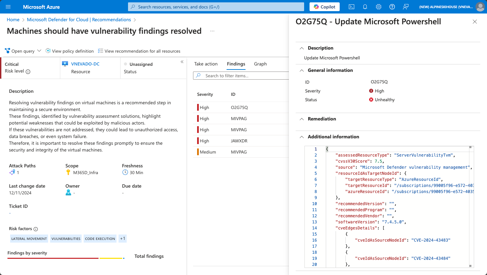
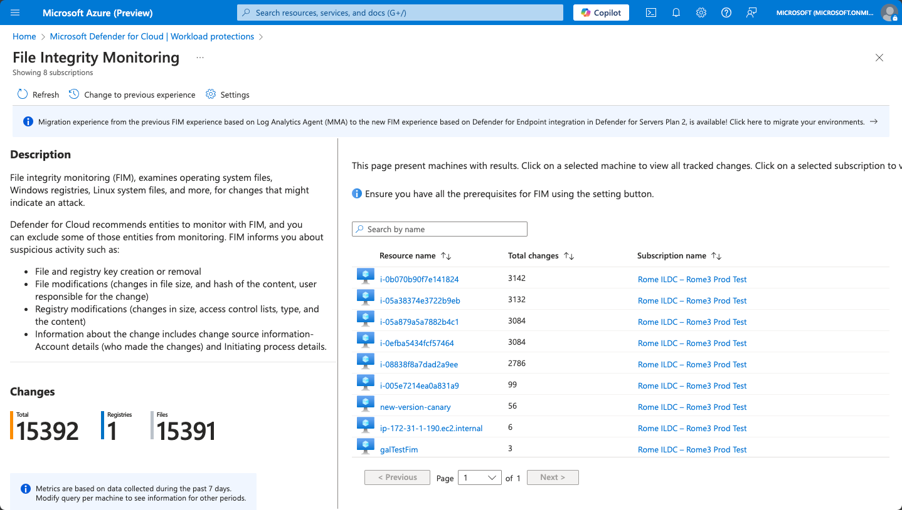
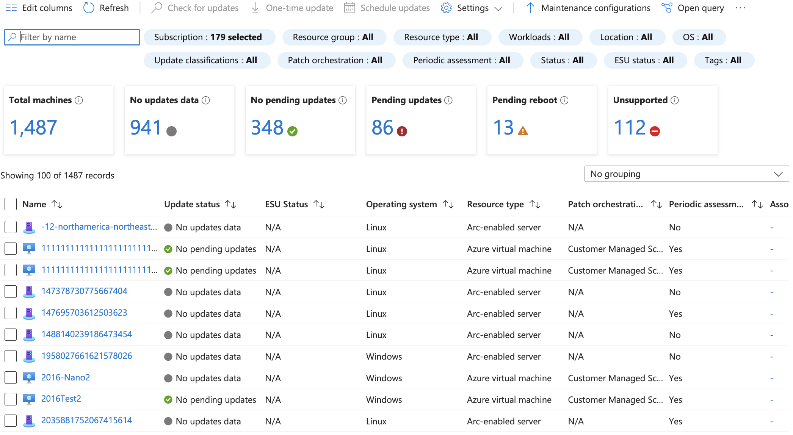
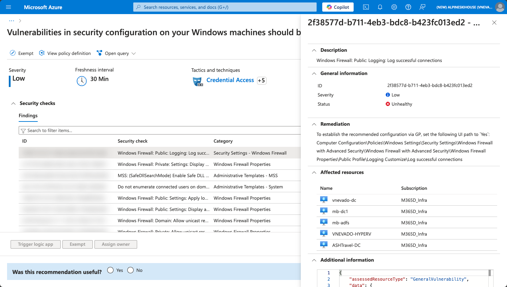
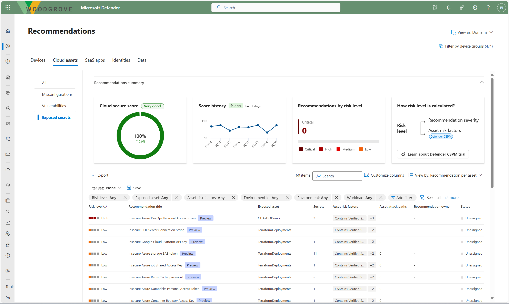
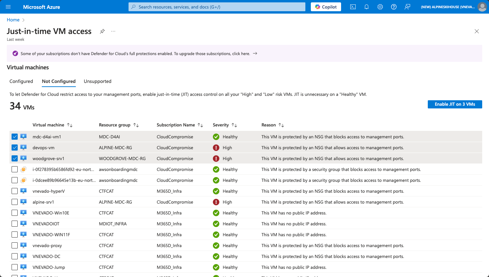
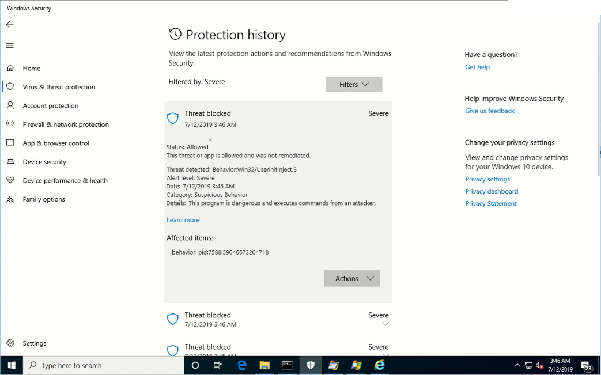
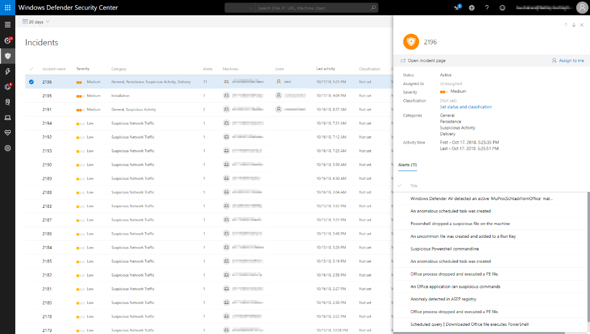

[🏠 전체 목차](README.md)　·　**Part 2 · 핵심 기능**　·　[04 · CWP](04-cwp.md)　·　**Defender for Servers**

# Defender for Servers

> [!NOTE]
> **보호 대상**: Azure·AWS·GCP·온프렘의 Windows/Linux VM (하이브리드·멀티클라우드 통합 뷰).
> Defender for Cloud는 에이전트 기반(**MDE**)과 **에이전트리스**를 결합한 하이브리드 방식으로, 워크로드 성능 영향 없이 서버를 보호합니다. 기능은 **① 가시성·컴플라이언스 → ② 공격 표면 축소 → ③ 고급 탐지·대응** 세 축으로 나뉩니다.

## 플랜 (Plan 1 · Plan 2)

| 기능 | Plan 1 | Plan 2 |
| --- | :---: | :---: |
| MDE 자동 온보딩 · **EDR** | ✅ | ✅ |
| 통합 경고·인시던트(Defender XDR) | ✅ | ✅ |
| 소프트웨어 인벤토리(MDVM) · 규정 준수 평가 | ✅ | ✅ |
| 에이전트 기반 취약성 스캔 | ✅ | ✅ |
| **에이전트리스 취약성/시크릿/악성코드 스캔** | ❌ | ✅ |
| **EPP 커버리지·구성 평가**(에이전트리스) | ❌ | ✅ |
| **Defender for DNS 경고** | ❌ | ✅ |
| Azure 네트워크 계층 위협 탐지 · 네트워크 맵 | ❌ | ✅ |
| **제어 평면(ARM) 위협 탐지** | ❌ | ✅ |
| 심화 OS 기준선(MCSB) 평가 · 시스템 업데이트 ¹ | ❌ | ✅ |
| MDVM 프리미엄 기능 | ❌ | ✅ |
| **파일 무결성 모니터링(FIM)** ¹ | ❌ | ✅ |
| **JIT VM 액세스** | ❌ | ✅ |
| 일 500MB 무료 데이터 수집 | ❌ | ✅ |

- **Plan 1** = MDE(EDR) 통합 중심 엔트리 레벨. 리소스 수준 켜기/끄기 가능. 온프렘 서버는 **Azure Arc 없이 MDE 에이전트 직접 설치**로도 온보딩할 수 있습니다(소비량 기반 과금, 경고·MDVM 데이터 동일 통합).
- **Plan 2** = P1 전체 + 에이전트리스 스캔·FIM·JIT·MCSB 기준 등. 구독 수준 활성화(리소스 수준 켜기는 불가, 끄기만 가능).
- ¹ 비(非)Azure(온프렘·AWS·GCP) 머신에서 FIM·시스템 업데이트·OS 기준선 평가를 쓰려면 **Azure Arc 온보딩**이 필요합니다. 기본 **MCSB OS 기준선 권장사항은 무료 기본 CSPM**에도 포함됩니다.

## ① 가시성 · 컴플라이언스

### 소프트웨어 인벤토리 · 취약성 평가 (MDVM)

Microsoft Defender 취약성 관리 기반으로 Windows/Linux의 설치 앱과 관련 **CVE**를 지속 검색합니다. MDE 기반 에이전트리스로 수집하며, 결과는 **권장사항 · Azure Resource Graph · API**로 확인합니다.

**MDVM 프리미엄(P2)** 은 보안 기준선 평가, 브라우저 확장·디지털 인증서 평가, 펌웨어·하드웨어 평가, 네트워크 공유 분석, **취약한 애플리케이션 차단**, Windows 인증 스캔을 추가로 제공합니다.

<small class="cap">머신별 취약성 발견 항목(CVE)·심각도·위험 요소를 권장사항에서 확인·수정</small>

### 파일 무결성 모니터링 (FIM)

OS 파일·Windows 레지스트리·Linux 시스템 파일의 변경을 검사해 공격 징후를 탐지합니다. **MDE에 네이티브 통합**되어 별도 에이전트가 필요 없습니다(레거시 MMA 기반 FIM은 지원 종료, 현재는 MDE 기반). *비Azure 머신은 Azure Arc 온보딩 필요.*

<small class="cap">머신별 변경 건수(파일·레지스트리)를 추적, 변경 주체·프로세스까지 기록</small>

### EPP 커버리지 · 구성 평가 (P2)

에이전트리스로 **EDR/EPP가 설치되지 않은 VM**을 지속 탐지하고, 오래된 서명·비활성화된 스캔·보호 등 런타임 구성 갭을 식별합니다. Microsoft Defender 외에 **CrowdStrike·SentinelOne·Cortex XDR·Trellix·Sophos·Symantec** 등 타사 EPP도 지원합니다.

## ② 공격 표면 축소

### OS 패치 관리 (Azure Update Manager)

누락된 업데이트를 온디맨드/주기 평가로 탐지하고, **유지관리 창·자동 패치·핫패치(재부팅 없이 적용)** 로 배포합니다. 하이브리드·멀티클라우드 전체 플릿의 컴플라이언스를 커스텀 리포트·경고로 관리합니다. *비Azure 머신은 Azure Arc 온보딩 필요.*

<small class="cap">전체 머신의 업데이트 상태(대기·재부팅 필요·미지원)를 한눈에</small>

### 하드닝 기준선 (MCSB)

**Microsoft 클라우드 보안 벤치마크** 기반 Windows/Linux 구성 권장사항으로 하드닝·컴플라이언스 상태를 추적하고, 규제 요건 충족을 지원합니다.

<small class="cap">Windows/Linux 구성 권장사항의 준수·미준수 상태를 추적</small>

### 시크릿 스캔

SSH 개인 키·스토리지 키·DB 연결 문자열 등 **50종 이상**의 평문 시크릿을 탐지해 측면 이동·무단 접근 위험을 줄입니다. 탐지된 시크릿에는 **파일 위치·대상 리소스·만료일·최근 접근 시각** 등 컨텍스트가 함께 제공됩니다.

<small class="cap">탐지된 시크릿의 유형·위치·대상 리소스 컨텍스트</small>

### JIT VM 액세스

RDP(3389)/SSH(22) 등 관리 포트를 평소 차단하고, 요청 시 Azure RBAC로 검증한 뒤 **NSG/Azure Firewall**을 통해 요청자 IP·포트·시간만 임시 개방합니다(만료 시 자동 원복). AWS에서는 EC2 보안 그룹을 사용합니다.

<small class="cap">VM별 위험도에 따라 JIT 미구성 머신을 식별하고 일괄 활성화</small>

## ③ 고급 탐지 · 대응

Defender for Servers는 **여러 계층에서 위협을 탐지**하고, 이를 강력한 **탐지·대응 엔진**으로 차단·조사합니다.

### 다층 위협 탐지

공격은 한 지점에서만 일어나지 않습니다. Defender for Servers는 아래 4개 계층에서 발생하는 신호를 동시에 수집·상관 분석해 경고를 생성합니다. **엔드포인트(MDE)는 P1**, **제어 평면·DNS·네트워크 계층 탐지는 P2**에 포함됩니다.

  

    💻
    <h4>엔드포인트MDE</h4>
    
Windows·Linux VM의 <b>OS 계층</b>에서 악성 프로세스·행위·파일을 탐지합니다. Microsoft Defender for Endpoint가 구동하며, 아래 <b>NGAV·EDR</b> 엔진으로 차단·대응합니다.

  

  

    🎛️
    <h4>제어 평면ARM</h4>
    
악성 <b>ARM 활동</b>을 탐지합니다 — 플래그된·프록시 IP 작업, <b>MicroBurst·PowerZure</b> 스크립트 공격, 권한 상승·백도어 생성, 자격 증명 접근·측면 이동. <b>VM 확장 악용</b>(정찰 모니터링 확장, run command 악성 스크립트, 크립토마이닝 GPU 확장, 랜섬웨어용 디스크 암호화)도 포함합니다.

  

  

    🌐
    <h4>DNSDefender for DNS</h4>
    
Azure DNS 쿼리를 심층 검사해 <b>DNS 터널링 데이터 유출</b>, <b>C&amp;C 통신</b>, 악성 DNS 리졸버·도메인(피싱·크립토마이닝 등)과의 통신을 실시간 탐지합니다. 2023-08-01부터 신규 구독은 Servers P2에 포함됩니다.

  

  

    📡
    <h4>네트워크</h4>
    
외부 악성 호스트와의 <b>C2(명령·제어) 통신</b>과 <b>RDP·SSH·SQL 브루트포스</b>를 네트워크 계층에서 탐지·완화합니다. <b>시그니처 + ML</b> 기반으로 1:1·다수:1 공격 시나리오를 모두 커버합니다.

  

### 차세대 백신 (NGAV)

Microsoft Defender for Endpoint 통합으로 **행동 기반 실시간 보호**를 제공합니다. **파일 기반·파일리스(fileless) 악성코드**를 모두 차단하고, 신뢰·비신뢰 애플리케이션의 악성 활동을 막습니다.

<small class="cap">Windows Security 보호 기록에서 탐지·차단 내역 확인</small>

### 엔드포인트 탐지·대응 (EDR)

Microsoft Defender for Endpoint 통합으로 실시간 공격 탐지·차단, **6개월치 데이터 기반 조사·헌팅**, 상관된 행동 경고, 풍부한 **대응 액션**을 제공합니다. MITRE ATT&CK 평가에서 업계 선도적 탐지 성능을 입증했으며, MDE는 지원 머신에 **자동 온보딩**됩니다.

<small class="cap">인시던트·경고를 통합 조사(Defender 포털/MDE)</small>

### 에이전트리스 악성코드 스캔 (P2)

Microsoft Defender Antivirus 엔진(시그니처·휴리스틱 + **ML·디토네이션·클라우드 인텔리전스**) 기반으로 **Quick·Full 스캔**을 제공합니다. VM **디스크 스냅샷을 격리 환경에서 분석**하므로 에이전트·네트워크·성능 영향이 없고, 에이전트를 설치할 수 없거나 관리되지 않는 머신까지 폭넓게 커버합니다.

### Defender Experts for Servers

Microsoft 분석가의 관리형 XDR·프로액티브 헌팅과 **Ask Defender Experts**(인시던트 질의)를 제공합니다(별도 구매). Detection Source가 Defender for Servers인 P1·P2 경고를 다루며(**DNS 경고는 범위 제외**), P1 또는 P2 활성화 + MDE 배포가 전제됩니다.

---

## 참고 링크

- [Defender for Servers 개요](https://learn.microsoft.com/en-us/azure/defender-for-cloud/defender-for-servers-overview)
- [취약성 관리(MDVM)](https://learn.microsoft.com/en-us/azure/defender-for-cloud/auto-deploy-vulnerability-assessment) · [파일 무결성 모니터링](https://learn.microsoft.com/en-us/azure/defender-for-cloud/file-integrity-monitoring-overview)
- [Azure Update Manager](https://learn.microsoft.com/en-us/azure/update-manager/overview) · [시크릿 스캔](https://learn.microsoft.com/en-us/azure/defender-for-cloud/secrets-scanning) · [JIT VM 액세스](https://learn.microsoft.com/en-us/azure/defender-for-cloud/just-in-time-access-overview)
- [Resource Manager 경고](https://learn.microsoft.com/en-us/azure/defender-for-cloud/alerts-azure-resource-manager) · [VM 확장 경고](https://learn.microsoft.com/en-us/azure/defender-for-cloud/alerts-azure-vm-extensions)

---

### 다음 읽을거리

| ◀ 이전 | ▶ 다음 |
| :-- | --: |
| [04 · CWP 개요](04-cwp.md) | [Storage →](cwp-storage.md) |

[🏠 전체 목차로 돌아가기](README.md)
