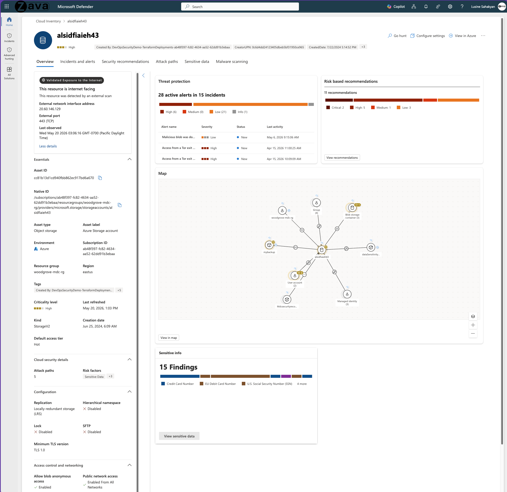
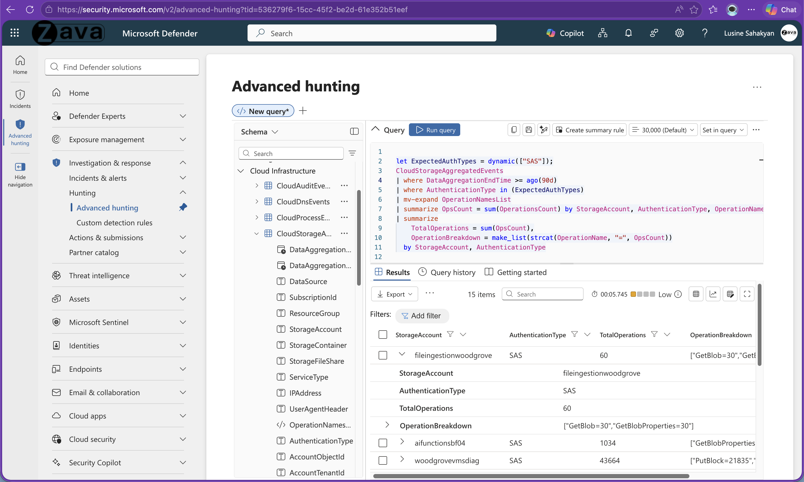
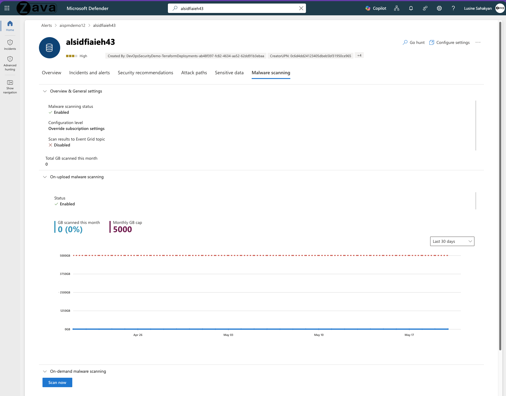

[🏠 전체 목차](README.md)　·　**Part 2 · 핵심 기능**　·　[04 · CWP](04-cwp.md)　·　**Defender for Storage**

# Defender for Storage

> [!NOTE]
> **보호 대상**: Azure Blob·Files·Data Lake (에이전트 불필요, Azure 네이티브).
> Microsoft의 스토리지 보안 전략은 **"안전하게 시작(Start secure) → 안전하게 유지(Stay secure)"** 입니다. ① 태세를 점검해 위험을 찾아 우선순위화하고, ② 위협을 탐지·대응하며, ③ 악성코드 확산을 차단합니다.

## ① 스토리지 위험 발견 · 우선순위화

### 태세 위험 발견 · 수정

관리형·섀도우 데이터 리소스를 스토리지 유형 전반에서 자동 검색하고, **네트워크 구성 오류·과도한 권한·노출된 데이터 흐름**을 식별합니다. 리소스 수준의 세분화된 가시성과 민감 데이터 인사이트를 제공하며, 위험 우선순위화 엔진으로 비즈니스 영향과 함께 맥락화해 단계별 수정 가이드를 제시합니다.

### 자산 컨텍스트 · 공격 경로

모든 클라우드 자산을 **한 화면에서 전체 맥락**으로 봅니다 — 외부 스캔으로 검증된 인터넷 노출, 활성 위협(Tor 종료 노드 접근·악성 blob·노출 컨테이너), 민감 데이터 발견, 구성 태세, 블래스트 반경(연결된 ID·리소스), 공격 경로. **공격 경로 분석**으로 인터넷 노출 → 민감 데이터까지의 악용 경로를 우선순위화합니다.

<small class="cap">단일 스토리지 계정의 위협·권장사항·민감 데이터·블래스트 반경을 한 화면에</small>

## ② 위협 탐지 · 대응

### 데이터 플레인 가시성

Azure Storage 트래픽의 **약 67%가 액세스 키·SAS 토큰**으로 이뤄집니다(컨트롤 플레인만 보면 사각지대). Defender for Storage는 **컨트롤 + 데이터 플레인 로그를 자동 분석**해, 신원 없이 진입하는 엔터티를 탐지합니다. **진단 로그 활성화가 필요 없습니다.**

### 위협 탐지 패밀리

- **악성 콘텐츠** — 악성코드 업로드·다운로드, VM/엔드포인트/앱으로의 확산, 피싱 콘텐츠 호스팅
- **민감 데이터 노출** — 인터넷 노출, 공개 컨테이너 스캐닝, 민감 데이터에 대한 비정상 익명 접근
- **의심스러운 접근 패턴** — Tor 종료 노드, 악성 IP, 의심 앱, 비정상 접근(위치·앱·인증)
- **의심스러운 동작** — 비정상 데이터 추출·접근 수준 조사·탐색·삭제 작업

### 신원 없는 엔터티 탐지 (SAS 토큰)

유출·오용된 액세스 토큰을 탐지합니다 — 내부에서만 쓰이던 과도한 권한 토큰의 외부 IP 접근(토큰 유출 의심), 외부 IP의 비정상 작업, 내부용 토큰의 외부 접근 등.

### 민감 데이터 노출·유출 탐지

스토리지 접근 수준 변경(인증 없는 공개 접근 허용)과 민감 데이터 포함 컨테이너의 의심 활동을 탐지해, SOC가 잠재적 데이터 유출을 신속히 분류·대응하게 합니다.

### 고급 헌팅 (Defender 포털)

Defender XDR 통합으로 `CloudStorageAggregatedEvents` 등 스토리지 이벤트를 환경 전반에서 상관·헌팅합니다.

<small class="cap">CloudStorageAggregatedEvents를 KQL로 조회해 SAS 사용·작업 패턴 헌팅</small>

## ③ 악성코드 스캔

### 근실시간 악성코드 스캔

Microsoft Defender Antivirus 기반으로 **업로드 시 + 온디맨드** 스캔합니다. 악성 파일을 격리·삭제해 확산을 막고, **GB당 과금**(월 GB 상한 설정 가능, 예: 5,000GB)으로 비용을 통제합니다. **Event Grid** 연동으로 자동 대응(삭제·격리·경보)을 구성할 수 있습니다.

<small class="cap">업로드 시·온디맨드 스캔 상태와 월 스캔 GB·상한을 확인</small>

### 해시 평판 분석

업로드된 파일 해시를 알려진 악성코드 해시와 비교해 전체 스캔 없이 신속 탐지합니다(*Put Block/Put Block List·SMB 파일 공유 미지원*).

## 활성화 · 운영

- **원클릭 활성화** — 구독 또는 스토리지 계정 수준으로 켭니다(기존·미래 계정 자동 보호). Terraform·Bicep·ARM·PowerShell·Azure Policy로 대규모 자동화 가능.
- **민감 데이터 위협 탐지**는 추가 비용 없이 켤 수 있습니다(Purview SIT·레이블 상속).
- **클래식 플랜** 사용 중이면 신규 기능을 위해 **신규 플랜으로 마이그레이션**이 필요합니다.

---

## 참고 링크

- [Defender for Storage 개요](https://learn.microsoft.com/en-us/azure/defender-for-cloud/defender-for-storage-introduction)
- [악성코드 스캔](https://learn.microsoft.com/en-us/azure/defender-for-cloud/defender-for-storage-malware-scan) · [민감 데이터 위협 탐지](https://learn.microsoft.com/en-us/azure/defender-for-cloud/defender-for-storage-data-sensitivity)
- [보안 경고(스토리지)](https://learn.microsoft.com/en-us/azure/defender-for-cloud/alerts-azure-storage)

---

### 다음 읽을거리

| ◀ 이전 | ▶ 다음 |
| :-- | --: |
| [Servers](cwp-servers.md) | [Databases →](cwp-databases.md) |

[🏠 전체 목차로 돌아가기](README.md)
