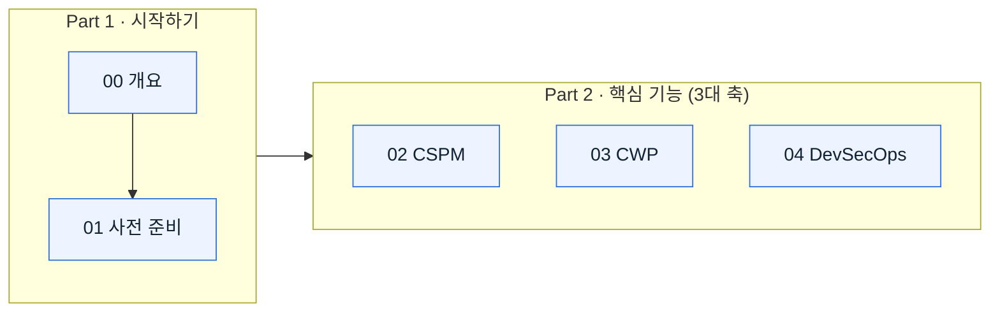

# Microsoft Defender for Cloud 가이드

**클라우드 보안 태세부터 워크로드 방어·DevSecOps까지, 개념에서 실습까지 한 번에.**

보안팀(SOC 분석가 · 클라우드 보안 엔지니어 · IT/보안 관리자 · DevSecOps 담당자 · CISO)이 **Microsoft Defender for Cloud(MDC)** 를 _이해하고 → 준비하고 → 직접 써 보도록_ 설계한 한국어 학습 코스입니다. 모든 설명은 **Microsoft Learn 공식 문서**를 근거로 하며, 페이지마다 1차 출처를 링크로 남겼습니다.

> [!NOTE]
> Defender for Cloud는 **CNAPP(Cloud Native Application Protection Platform)** 입니다. 즉 하나의 제품 안에 **CSPM(태세 관리) · CWP(워크로드 보호) · DevSecOps(코드 보안)** 세 축이 통합되어 있습니다. 이 코스의 Part 2는 이 세 축을 각각 한 문서로 나눠 깊이 다룹니다.

---

## 🚀 어디부터 시작할까요?

읽는 목적에 따라 들어오세요.

- **"Defender for Cloud가 뭔지 빠르게 감 잡고 싶어요"** → [개요 한 장 보기](./00-overview.md) _(약 7분)_
- **"우리 조직에 도입하려면 뭐가 필요하죠?"** → [사전 준비 · 플랜 · 역할](./01-prerequisites.md) _(약 11분)_
- **"바로 태세 관리부터 볼게요"** → [CSPM](./02-cspm.md) _(약 15분)_

> [!TIP]
> 처음이라면 위에서 아래로 순서대로 읽는 것을 권장합니다. 각 페이지 상단에 **학습 목표·예상 소요 시간·대상 독자**가 표시되어, 필요한 부분만 골라 읽기에도 좋습니다.

---

## 🗺️ 학습 여정

> [!TIP]
> 위 다이어그램의 각 노드를 클릭하면 해당 페이지로 이동합니다.

---

## 📚 전체 코스

### Part 1 · 시작하기 — _무엇이고, 무엇이 필요한가_

| 페이지 | 이 페이지의 핵심 | 소요 |
| --- | --- | --- |
| [**00 · 개요**](./00-overview.md) | CNAPP의 정의, 3대 축(CSPM·CWP·DevSecOps), 멀티클라우드/하이브리드, Defender 포털·XDR 통합, 동작 원리 | 7분 |
| [**01 · 사전 준비**](./01-prerequisites.md) | 기본 CSPM vs 유료 플랜, 전체 Defender for Cloud 플랜 목록, 온보딩(Azure·AWS·GCP·Arc), **역할·RBAC**, 데이터 지역 | 11분 |

### Part 2 · 핵심 기능 — _실제로 무엇을 할 수 있는가_

| 페이지 | 이 페이지의 핵심 | 소요 |
| --- | --- | --- |
| [**02 · CSPM**](./02-cspm.md) | 보안 점수·권장사항·거버넌스·공격 경로·DSPM·CIEM·AI-SPM·규정 준수 등 태세 관리 심화 | 15분 |
| [**03 · CWP**](./03-cwp.md) | Servers·Storage·Databases·Containers·App Service·Key Vault·Resource Manager·APIs·AI 등 워크로드별 위협 보호 | 15분 |
| [**04 · DevSecOps**](./04-devsecops.md) | 코드 투 클라우드, GitHub·Azure DevOps·GitLab 커넥터, IaC/시크릿 스캔, PR 주석 | 13분 |

### Part 3 · 실습과 활용 — _준비 중_

> 🚧 **핸즈온 랩·실무 활용 데모는 업데이트 준비 중입니다.** 곧 공개될 예정입니다.

---

## 🧭 역할별 추천 경로

| 역할 | 추천 순서 | 왜 |
| --- | --- | --- |
| **클라우드 보안 엔지니어** | 00 → 02 → 03 → 04 | 태세·워크로드 보호를 개념부터 심화까지 |
| **보안/IT 관리자 · 도입 담당** | 01 → 00 → 03 | 온보딩 요건·플랜·역할, 워크로드 보호 |
| **DevSecOps / 플랫폼 엔지니어** | 00 → 04 → 02 | 코드 투 클라우드, 파이프라인 보안 |
| **SOC 분석가 / 위협 헌터** | 02 → 03 → 04 | 경고·인시던트·공격 경로 조사, XDR 통합 |
| **CISO / 의사결정자** | 00 → 03 → 01 | 가치·태세·거버넌스·비용을 큰 그림으로 |

---

## 🔑 자주 쓰는 포털

| 포털 | 주소 | 용도 |
| --- | --- | --- |
| **Azure 포털 (MDC)** | https://portal.azure.com → *Microsoft Defender for Cloud* | 플랜 활성화, 환경 설정, 권장사항·규정 준수 |
| **Microsoft Defender 포털** | https://security.microsoft.com | 통합 XDR 경험(경고·인시던트·헌팅·노출 관리) |

---

## 📖 근거와 출처

이 코스의 모든 기술적 서술은 **Microsoft Learn** 공식 문서를 1차 출처로 하며, 각 페이지 하단에 링크를 정리했습니다. 기능의 **GA / 미리 보기(Preview)** 상태는 문서 기준으로 표기했으나, 클라우드 서비스 특성상 빠르게 변할 수 있으니 도입·운영 시에는 반드시 최신 공식 문서를 재확인하세요.

- 대표 출처: [Defender for Cloud 소개](https://learn.microsoft.com/en-us/azure/defender-for-cloud/defender-for-cloud-introduction)

---

### 다음 읽을거리

| ▶ 다음 |
| --: |
| [00 · 개요](./00-overview.md) |
